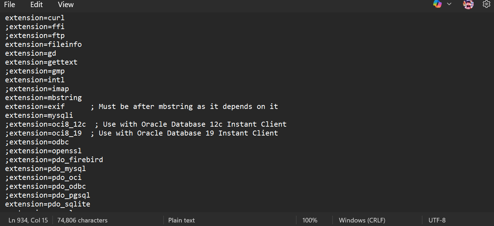
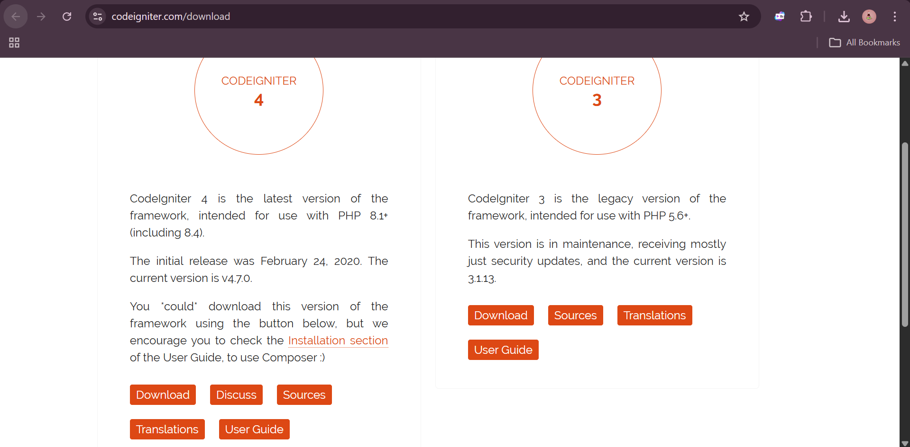
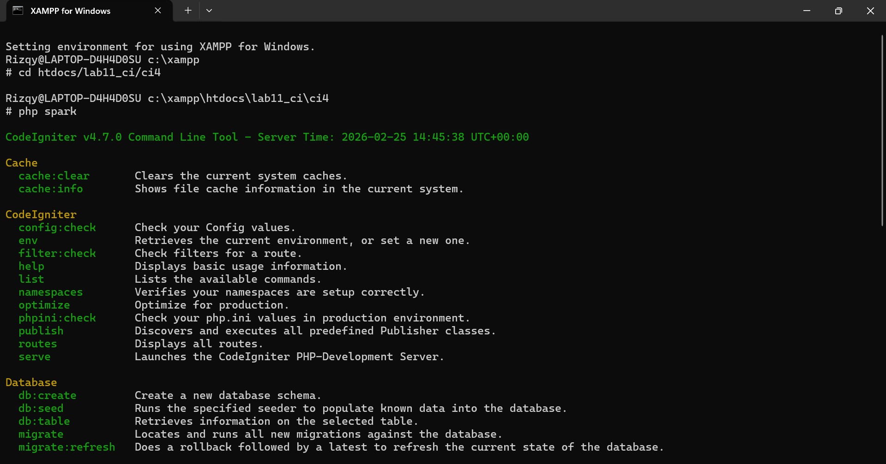
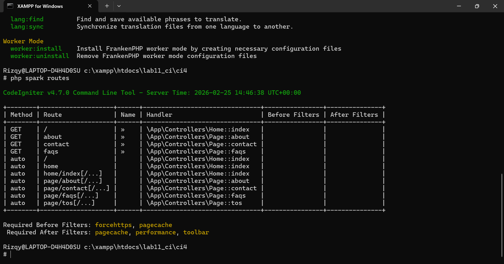
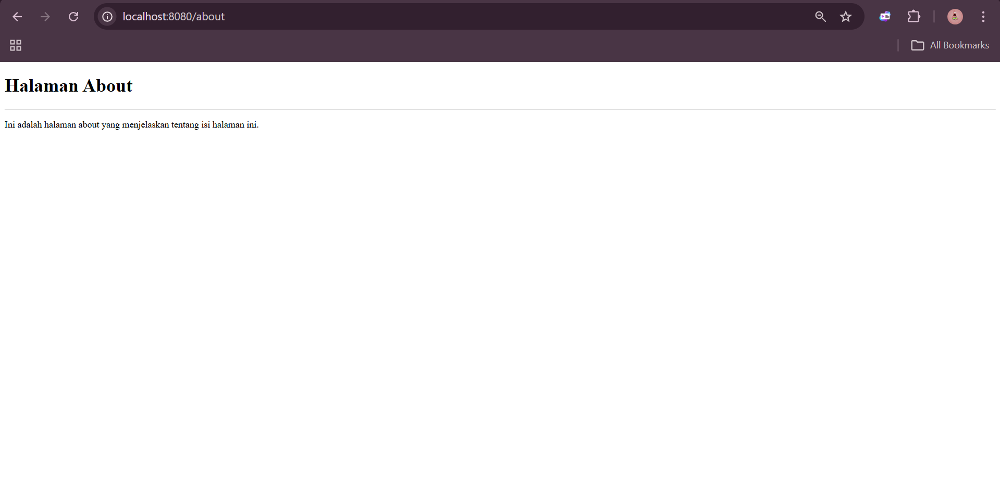
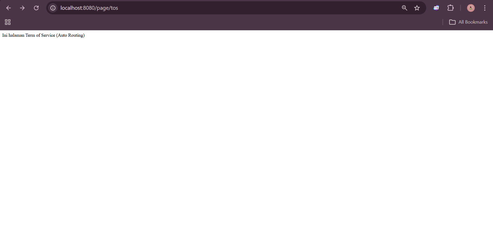
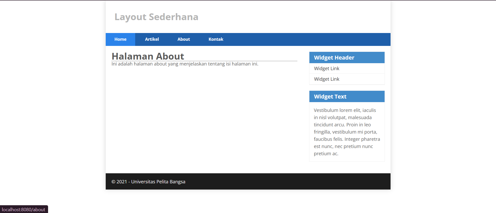

# 📘 Praktikum 1 – Pemrograman Web 2 (CodeIgniter 4)

**Nama:** M. Rizqy Al
**NIM:** 312410424
**Kelas:** I241C
**Mata Kuliah:** Pemrograman Web 2
**Dosen:** Agung Nugroho

---

## 🎯 Tujuan Praktikum

1. Memahami konsep dasar framework
2. Memahami konsep MVC (Model View Controller)
3. Membuat aplikasi web sederhana menggunakan CodeIgniter 4

---

## 🛠️ Persiapan Lingkungan

Sebelum menggunakan CodeIgniter 4, dilakukan konfigurasi PHP pada XAMPP dengan mengaktifkan ekstensi berikut:

* php-json
* php-mysqlnd
* php-xml
* php-intl
* libcurl (opsional)

### Langkah:

1. Buka XAMPP Control Panel
2. Apache → Config → `php.ini`
3. Hilangkan tanda `;` pada ekstensi
4. Simpan dan restart Apache

📷 Screenshot:


---

## 📦 Instalasi CodeIgniter 4

Langkah instalasi manual:

1. Download CodeIgniter 4
2. Extract ke folder:

```
htdocs/lab11_ci
```

3. Rename folder menjadi:

```
ci4
```

4. Jalankan pada browser:

```
http://localhost/lab11_ci/ci4/public
```

📷 Screenshot:


---

## 💻 Menjalankan CLI CodeIgniter

Masuk ke folder project:

```
xampp/htdocs/lab11_ci/ci4
```

Jalankan perintah:

```
php spark
```

📷 Screenshot:


---

## 🧩 Konsep MVC

MVC adalah arsitektur pemrograman:

* **Model** → pengolahan data
* **View** → tampilan
* **Controller** → logika aplikasi

CodeIgniter menggunakan konsep MVC berbasis OOP.

---

## 🔀 Routing CodeIgniter

File routing:

```
app/Config/Routes.php
```

Tambahkan route:

```php
$routes->get('/', 'Home::index');
$routes->get('/about', 'Page::about');
$routes->get('/contact', 'Page::contact');
$routes->get('/faqs', 'Page::faqs');
```

Cek routing:

```
php spark routes
```

📷 Screenshot:


---

## 🎮 Membuat Controller

File:

```
app/Controllers/Page.php
```

Isi:

```php
<?php

namespace App\Controllers;

class Page extends BaseController
{
    public function about()
    {
        echo "Ini halaman About";
    }

    public function contact()
    {
        echo "Ini halaman Contact";
    }

    public function faqs()
    {
        echo "Ini halaman FAQ";
    }
}
```

Akses:

```
http://localhost:8080/about
```

📷 Screenshot:


---

## ⚡ Auto Routing

Tambahkan method:

```php
public function tos()
{
    echo "Ini halaman Term of Services";
}
```

Akses:

```
http://localhost:8080/page/tos
```

📷 Screenshot:


---

## 🖼️ Membuat View

File:

```
app/Views/about.php
```

Isi:

```php
<!DOCTYPE html>
<html>
<head>
    <title><?= $title; ?></title>
</head>
<body>
    <h1><?= $title; ?></h1>
    <p><?= $content; ?></p>
</body>
</html>
```

Ubah controller:

```php
public function about()
{
    return view('about', [
        'title' => 'Halaman About',
        'content' => 'Ini adalah halaman About'
    ]);
}
```

📷 Screenshot:


---

## 🎨 Layout dengan Template & CSS

Struktur:

```
app/Views/template/header.php
app/Views/template/footer.php
public/style.css
```

Pemanggilan di view:

```php
<?= $this->include('template/header'); ?>

<h1><?= $title; ?></h1>
<p><?= $content; ?></p>

<?= $this->include('template/footer'); ?>
```

📷 Screenshot:


---

## 📌 Hasil Akhir

Menu navigasi berhasil menampilkan:

* Home
* Artikel
* About
* Contact

Semua halaman menggunakan layout yang sama.

---

## ✅ Kesimpulan

Pada praktikum ini telah dipelajari:

* Instalasi CodeIgniter 4
* Konfigurasi environment
* Struktur direktori CI4
* Konsep MVC
* Routing dan Controller
* View dan Template Layout


Tambahkan seluruh screenshot hasil praktikum di bagian ini sesuai urutan langkah.
