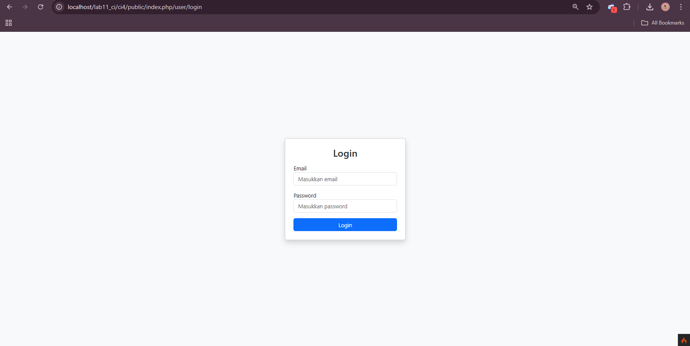

# 📘 Praktikum 1 – Pemrograman Web 2 (CodeIgniter 4)

**Nama:** M. Rizqy Al
**NIM:** 312410424
**Kelas:** I241C
**Mata Kuliah:** Pemrograman Web 2
**Dosen:** Agung Nugroho

---

## 🎯 Tujuan Praktikum

1. Memahami konsep dasar framework
2. Memahami konsep MVC (Model View Controller)
3. Membuat aplikasi web sederhana menggunakan CodeIgniter 4

---

## 🛠️ Persiapan Lingkungan

Sebelum menggunakan CodeIgniter 4, dilakukan konfigurasi PHP pada XAMPP dengan mengaktifkan ekstensi berikut:

* php-json
* php-mysqlnd
* php-xml
* php-intl
* libcurl (opsional)

### Langkah:

1. Buka XAMPP Control Panel
2. Apache → Config → `php.ini`
3. Hilangkan tanda `;` pada ekstensi
4. Simpan dan restart Apache

📷 Screenshot:


---

## 📦 Instalasi CodeIgniter 4

Langkah instalasi manual:

1. Download CodeIgniter 4
2. Extract ke folder:

```
htdocs/lab11_ci
```

3. Rename folder menjadi:

```
ci4
```

4. Jalankan pada browser:

```
http://localhost/lab11_ci/ci4/public
```

📷 Screenshot:


---

## 💻 Menjalankan CLI CodeIgniter

Masuk ke folder project:

```
xampp/htdocs/lab11_ci/ci4
```

Jalankan perintah:

```
php spark
```

📷 Screenshot:


---

## 🧩 Konsep MVC

MVC adalah arsitektur pemrograman:

* **Model** → pengolahan data
* **View** → tampilan
* **Controller** → logika aplikasi

CodeIgniter menggunakan konsep MVC berbasis OOP.

---

## 🔀 Routing CodeIgniter

File routing:

```
app/Config/Routes.php
```

Tambahkan route:

```php
$routes->get('/', 'Home::index');
$routes->get('/about', 'Page::about');
$routes->get('/contact', 'Page::contact');
$routes->get('/faqs', 'Page::faqs');
```

Cek routing:

```
php spark routes
```

📷 Screenshot:


---

## 🎮 Membuat Controller

File:

```
app/Controllers/Page.php
```

Isi:

```php
<?php

namespace App\Controllers;

class Page extends BaseController
{
    public function about()
    {
        echo "Ini halaman About";
    }

    public function contact()
    {
        echo "Ini halaman Contact";
    }

    public function faqs()
    {
        echo "Ini halaman FAQ";
    }
}
```

Akses:

```
http://localhost:8080/about
```

📷 Screenshot:


---

## ⚡ Auto Routing

Tambahkan method:

```php
public function tos()
{
    echo "Ini halaman Term of Services";
}
```

Akses:

```
http://localhost:8080/page/tos
```

📷 Screenshot:


---

## 🖼️ Membuat View

File:

```
app/Views/about.php
```

Isi:

```php
<!DOCTYPE html>
<html>
<head>
    <title><?= $title; ?></title>
</head>
<body>
    <h1><?= $title; ?></h1>
    <p><?= $content; ?></p>
</body>
</html>
```

Ubah controller:

```php
public function about()
{
    return view('about', [
        'title' => 'Halaman About',
        'content' => 'Ini adalah halaman About'
    ]);
}
```

📷 Screenshot:


---

## 🎨 Layout dengan Template & CSS

Struktur:

```
app/Views/template/header.php
app/Views/template/footer.php
public/style.css
```

Pemanggilan di view:

```php
<?= $this->include('template/header'); ?>

<h1><?= $title; ?></h1>
<p><?= $content; ?></p>

<?= $this->include('template/footer'); ?>
```

📷 Screenshot:


---

## 📌 Hasil Akhir

Menu navigasi berhasil menampilkan:

* Home
* Artikel
* About
* Contact

Semua halaman menggunakan layout yang sama.

---

## ✅ Kesimpulan

Pada praktikum ini telah dipelajari:

* Instalasi CodeIgniter 4
* Konfigurasi environment
* Struktur direktori CI4
* Konsep MVC
* Routing dan Controller
* View dan Template Layout


# 📗 Praktikum 2 – CRUD (Framework Lanjutan)

## 🎯 Tujuan

Membuat aplikasi CRUD sederhana menggunakan CodeIgniter 4.

---

## 🛠️ Persiapan

* Mengaktifkan **Apache & MySQL** pada XAMPP
* Menyiapkan database

---

## 🗄️ Membuat Database

Membuat database dengan nama:

```
lab_ci4
```

Kemudian membuat tabel `artikel`.

---

## 🔗 Koneksi Database

Konfigurasi dilakukan melalui file:

```
.env
```

---

## 🧩 Membuat Model

File:

```
app/Models/ArtikelModel.php
```

```php
<?php
namespace App\Models;

use CodeIgniter\Model;

class ArtikelModel extends Model
{
    protected $table = 'artikel';
    protected $primaryKey = 'id';
    protected $useAutoIncrement = true;
    protected $allowedFields = ['judul', 'isi', 'status', 'slug', 'gambar'];
}
```

---

## 🎮 Membuat Controller

File:

```
app/Controllers/Artikel.php
```

```php
<?php 

namespace App\Controllers; 

use App\Models\ArtikelModel;

class Artikel extends BaseController 
{
    public function index()
    {
        $title = 'Daftar Artikel';
        $model = new ArtikelModel();
        $artikel = $model->findAll();

        return view('artikel/index', compact('artikel', "title"));
    }
}
```

---

## 🖼️ Membuat View

File:

```
app/Views/artikel/index.php
```

```php
<?= $this->include('template/header'); ?>

<?php if ($artikel): ?>
    <?php foreach ($artikel as $row): ?>
        <article class="entry">
            <h2>
                <a href="<?= base_url('/artikel/' . $row['slug']); ?>">
                    <?= $row['judul']; ?>
                </a>
            </h2>

            " 
                 alt="<?= $row['judul']; ?>">

            <p><?= substr($row['isi'], 0, 200); ?></p>
        </article>

        <hr class="divider" />
    <?php endforeach; ?>
<?php else: ?>
    <article class="entry">
        <h2>Belum ada data.</h2>
    </article>
<?php endif; ?>

<?= $this->include('template/footer'); ?>
```

---

## 🔍 Detail Artikel

### Controller

```php
public function view($slug)
{
    $model = new ArtikelModel();
    $artikel = $model->where(['slug' => $slug])->first();

    if (!$artikel) {
        throw \CodeIgniter\Exceptions\PageNotFoundException::forPageNotFound();
    }

    $title = $artikel['judul'];
    return view('artikel/detail', compact('artikel', 'title'));
}
```

### Routing

```php
$routes->get('/artikel/(:any)', 'Artikel::view/$1');
```

---

## ⚙️ Menu Admin (CRUD)

### Routing

```php
$routes->group('admin', function($routes) {
    $routes->get('artikel', 'Artikel::admin_index');
    $routes->add('artikel/add', 'Artikel::add');
    $routes->add('artikel/edit/(:any)', 'Artikel::edit/$1');
    $routes->get('artikel/delete/(:any)', 'Artikel::delete/$1');
});
```

---

## ➕ Tambah Data

Menggunakan method `add()` dengan validasi input.

---

## ✏️ Edit Data

Menggunakan method `edit()` untuk memperbarui data artikel.

---

## ❌ Hapus Data

```php
public function delete($id)
{
    $artikel = new ArtikelModel();
    $artikel->delete($id);

    return redirect()->to('/admin/artikel');
}
```

---

# 📙 Praktikum 3 – View Layout & View Cell

## 🧩 View Layout

Layout digunakan untuk membuat tampilan halaman yang konsisten.

File:

```
app/Views/layout/main.php
```

Menggunakan:

```php
<?= $this->renderSection('content') ?>
```

---

## 🔄 Modifikasi View

```php
<?= $this->extend('layout/main') ?>

<?= $this->section('content') ?>
<h1><?= $title; ?></h1>
<p><?= $content; ?></p>
<?= $this->endSection() ?>
```

---

## 🔁 View Cell

View Cell adalah komponen reusable yang memiliki logic sendiri.

### Class View Cell

```
app/Cells/ArtikelTerkini.php
```

```php
class ArtikelTerkini extends Cell
{
    public function render()
    {
        $model = new ArtikelModel();

        $artikel = $model->orderBy('created_at', 'DESC')
                         ->limit(5)
                         ->findAll();

        return view('components/artikel_terkini', [
            'artikel' => $artikel
        ]);
    }
}
```

---

## 📌 Perbedaan

| View Biasa             | View Cell                |
| ---------------------- | ------------------------ |
| Hanya menampilkan data | Bisa punya logic sendiri |
| Bergantung controller  | Bisa ambil data sendiri  |

---

## ✅ Manfaat View Layout

* Konsistensi tampilan
* Mempermudah maintenance
* Menghemat waktu development
* Memisahkan logic dan tampilan

---

# 📕 Praktikum 4 – Modul Login

## 🗄️ Tabel User

```sql
CREATE TABLE user (
    id INT auto_increment,
    username VARCHAR(200),
    useremail VARCHAR(200),
    userpassword VARCHAR(200),
    PRIMARY KEY(id)
);
```

---

## 🧩 Model User

```php
class UserModel extends Model
{
    protected $table = 'user';
    protected $allowedFields = ['username', 'useremail', 'userpassword'];
}
```

---

## 🎮 Controller Login

Fungsi utama:

* Login user
* Validasi password
* Menyimpan session

---

## 🔐 Auth Filter

Digunakan untuk membatasi akses halaman admin:

```php
if (!session()->get('logged_in')) {
    return redirect()->to('/user/login');
}
```

---

## 🌱 Seeder

```bash
php spark make:seeder UserSeeder
php spark db:seed UserSeeder
```
📷 Screenshot:


---

## 🚪 Logout

```php
public function logout()
{
    session()->destroy();
    return redirect()->to('/user/login');
}
```

---

## 📌 Kesimpulan

Pada praktikum ini berhasil dibuat:

* Sistem CRUD artikel
* Layout dan komponen modular
* Sistem login dengan autentikasi
* Proteksi halaman menggunakan filter

Framework CodeIgniter 4 mempermudah pengembangan aplikasi web dengan struktur MVC yang terorganisir.

