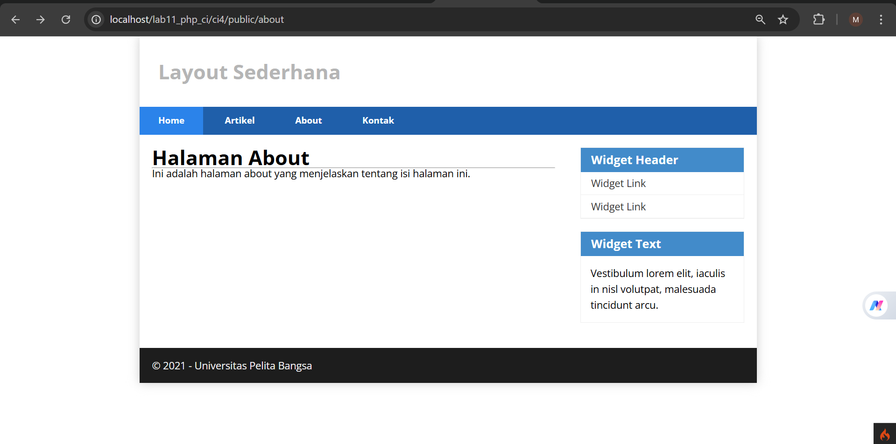

# 🚀 Praktikum 1 — Pemrograman Web 2 (Instalasi CodeIgniter 4)

## Identitas Mahasiswa

| Keterangan | Detail |
|---|---|
| **Nama** | Muhamad Nikmal Wahid |
| **NIM** | 312410372 |
| **Kelas** | I241C |
| **Mata Kuliah** | Pemrograman Web 2 |

---

# 📚 Daftar Isi

- [Pendahuluan](#pendahuluan)
- [Teori Dasar](#teori-dasar)
  - [1. Framework CodeIgniter 4](#1-framework-codeigniter-4)
  - [2. CLI pada CodeIgniter](#2-cli-pada-codeigniter)
  - [3. Routing dan Controller](#3-routing-dan-controller)
  - [4. View dan Layout](#4-view-dan-layout)
- [Langkah-langkah Praktikum](#langkah-langkah-praktikum)
  - [1. Instalasi CodeIgniter 4](#1-instalasi-codeigniter-4)
  - [2. Menjalankan CLI](#2-menjalankan-cli-command-line-interface)
  - [3. Mengaktifkan Mode Debugging](#3-mengaktifkan-mode-debugging)
  - [4. Router dan Controller](#4-router-dan-controller)
  - [5. Membuat Route Baru](#5-membuat-route-baru)
  - [6. Membuat Controller](#6-membuat-controller)
  - [7. Membuat View](#7-membuat-view)
  - [8. Membuat Layout Header dan Footer](#8-membuat-layout-header-dan-footer)
- [Pertanyaan dan Tugas](#pertanyaan-dan-tugas)
- [Kesimpulan](#kesimpulan)

---

# Pendahuluan

Pada praktikum ini dilakukan proses instalasi dan pengenalan dasar framework **CodeIgniter 4**. Praktikum berfokus pada konfigurasi awal framework, penggunaan routing, controller, view, serta penerapan layout sederhana menggunakan header dan footer.

Tujuan praktikum ini adalah agar mahasiswa memahami dasar penggunaan framework CodeIgniter 4 dalam pengembangan aplikasi web berbasis MVC (*Model-View-Controller*).

---

# Teori Dasar

## 1. Framework CodeIgniter 4

CodeIgniter 4 adalah framework PHP berbasis MVC yang digunakan untuk membangun aplikasi web secara cepat, ringan, dan terstruktur.

Beberapa keunggulan CodeIgniter 4:

- Ringan dan cepat
- Struktur MVC yang rapi
- Memiliki CLI bawaan
- Mendukung routing
- Mempermudah pengelolaan aplikasi web

---

## 2. CLI pada CodeIgniter

CLI (*Command Line Interface*) merupakan fitur bawaan CodeIgniter 4 yang digunakan untuk membantu proses development melalui terminal atau command prompt.

Contoh penggunaan CLI:

| Perintah | Fungsi |
|---|---|
| `php spark` | Menampilkan daftar command |
| `php spark routes` | Menampilkan daftar routing |
| `php spark serve` | Menjalankan development server |

---

## 3. Routing dan Controller

### Routing

Routing digunakan untuk menentukan URL yang akan diarahkan ke controller tertentu.

Contoh:

```php
$routes->get('/', 'Home::index');
```

### Controller

Controller berfungsi sebagai penghubung antara model dan view.

Controller bertugas:

- Mengelola request pengguna
- Memproses data
- Menampilkan halaman view

---

## 4. View dan Layout

View digunakan untuk menampilkan tampilan aplikasi kepada pengguna.

Sedangkan layout digunakan untuk menjaga konsistensi tampilan seperti:

- Header
- Footer
- Sidebar
- Navigasi

Dengan layout, struktur halaman menjadi lebih rapi dan reusable.

---

# Langkah-langkah Praktikum

# 1. Instalasi CodeIgniter 4

Langkah instalasi CodeIgniter 4:

1. Unduh CodeIgniter melalui website resmi:

```text
https://codeigniter.com/download
```

2. Extract file ZIP ke direktori:

```text
htdocs/lab11_ci
```

3. Ubah nama folder framework:

```text
framework-4.x.xx → ci4
```

4. Jalankan project melalui browser:

```text
http://localhost/lab11_ci/ci4/public/
```

---

## Tampilan Instalasi


---

# 2. Menjalankan CLI (Command Line Interface)

CodeIgniter menyediakan CLI untuk membantu proses development.

Masuk ke direktori project melalui terminal atau command prompt, kemudian jalankan:

```bash
php spark
```

Perintah tersebut digunakan untuk menampilkan seluruh command yang tersedia pada CodeIgniter 4.

---

# 3. Mengaktifkan Mode Debugging

Mode debugging digunakan untuk menampilkan detail error ketika terjadi kesalahan pada aplikasi.

---

## Langkah Mengaktifkan Debugging

1. Ubah nama file:

```text
env → .env
```

2. Buka file `.env`

3. Ubah konfigurasi berikut:

```env
CI_ENVIRONMENT = development
```

---

## Tampilan Environment


---

# 4. Router dan Controller

File routing berada pada:

```text
app/Config/Routes.php
```

Contoh route bawaan:

```php
$routes->get('/', 'Home::index');
```

Route tersebut akan mengarahkan halaman utama ke controller `Home`.

---

# 5. Membuat Route Baru

Tambahkan route berikut pada file `Routes.php`:

```php
$routes->get('/about', 'Page::about');

$routes->get('/contact', 'Page::contact');

$routes->get('/faqs', 'Page::faqs');
```

---

## Mengecek Route

Gunakan CLI berikut untuk mengecek route:

```bash
php spark routes
```

---

## Tampilan Route


---

# 6. Membuat Controller

Buat file berikut:

```text
app/Controllers/Page.php
```

Isi file dengan kode berikut:

```php
<?php

namespace App\Controllers;

class Page extends BaseController
{
    public function about()
    {
        echo "Ini halaman About";
    }

    public function contact()
    {
        echo "Ini halaman Contact";
    }

    public function faqs()
    {
        echo "Ini halaman FAQ";
    }
}
```

---

## Penjelasan Controller

| Method | Fungsi |
|---|---|
| `about()` | Menampilkan halaman About |
| `contact()` | Menampilkan halaman Contact |
| `faqs()` | Menampilkan halaman FAQ |

---

# 7. Membuat View

Buat file berikut:

```text
app/Views/about.php
```

Isi file dengan kode berikut:

```php
<!DOCTYPE html>
<html lang="en">

<head>
    <meta charset="UTF-8">

    <title><?= $title; ?></title>

    <link rel="stylesheet"
          href="<?= base_url('styles.css'); ?>">
</head>

<body>

<?= $this->include('template/header.php'); ?>

<h1><?= esc($title); ?></h1>

<hr>

<p><?= esc($content); ?></p>

<?= $this->include('template/footer.php'); ?>

</body>
</html>
```

---

## Mengubah Method About pada Controller

Ubah method `about()` menjadi:

```php
public function about()
{
    return view('about', [

        'title'   => 'Halaman About',

        'content' => 'Ini adalah halaman about yang menjelaskan tentang isi halaman ini.'

    ]);
}
```

Method tersebut digunakan untuk mengirim data ke halaman view.

---

# 8. Membuat Layout Header dan Footer

Layout digunakan agar tampilan halaman lebih konsisten.

---

## Header

Buat file:

```text
app/Views/template/header.php
```

Isi file dengan kode berikut:

```php
<!DOCTYPE html>
<html lang="en">

<head>

    <meta charset="UTF-8">

    <title><?= $title; ?></title>

    <link rel="stylesheet"
          href="<?= base_url('styles.css'); ?>">

</head>

<body>

<div id="container">

    <header>
        <h1>Layout Sederhana</h1>
    </header>

    <nav>

        <a href="<?= base_url('/'); ?>"
           class="active">Home</a>

        <a href="<?= base_url('/artikel'); ?>">
            Artikel
        </a>

        <a href="<?= base_url('/about'); ?>">
            About
        </a>

        <a href="<?= base_url('/contact'); ?>">
            Kontak
        </a>

    </nav>

<section id="wrapper">

<section id="main">
```

---

## Footer

Buat file:

```text
app/Views/template/footer.php
```

Isi file dengan kode berikut:

```php
</section>

<aside id="sidebar">

    <div class="widget-box">

        <h3 class="title">Widget Header</h3>

        <ul>
            <li><a href="#">Widget Link</a></li>
            <li><a href="#">Widget Link</a></li>
        </ul>

    </div>

    <div class="widget-box">

        <h3 class="title">Widget Text</h3>

        <p>
            Vestibulum lorem elit,
            iaculis in nisl volutpat,
            malesuada tincidunt arcu.
        </p>

    </div>

</aside>

</section>

<footer>
    <p>&copy; 2021 - Universitas Pelita Bangsa</p>
</footer>

</div>

</body>
</html>
```

---

## Tampilan View



---

# Pertanyaan dan Tugas

## Soal

Lengkapi kode program untuk menu lainnya yang ada pada Controller `Page`, sehingga seluruh link pada navigasi header dapat menampilkan tampilan dengan layout yang sama.

---

## Jawaban

### Membuat File View Tambahan

Buat beberapa file pada direktori:

```text
app/Views
```

Contoh:

- `contact.php`
- `artikel.php`
- `faqs.php`
- `tos.php`

Isi file view menggunakan layout yang sama:

```php
<!DOCTYPE html>
<html lang="en">

<head>

    <meta charset="UTF-8">

    <title><?= $title; ?></title>

    <link rel="stylesheet"
          href="<?= base_url('styles.css'); ?>">

</head>

<body>

<?= $this->include('template/header.php'); ?>

<h1><?= esc($title); ?></h1>

<hr>

<p><?= esc($content); ?></p>

<?= $this->include('template/footer.php'); ?>

</body>
</html>
```

---

## Mengubah Controller Page

```php
<?php

namespace App\Controllers;

class Page extends BaseController
{
    public function about()
    {
        return view('about', [

            'title' => 'Halaman About',

            'content' => 'Ini adalah halaman about yang menjelaskan tentang isi halaman ini.'

        ]);
    }

    public function contact()
    {
        return view('contact', [

            'title' => 'Halaman Contact',

            'content' => 'Ini adalah halaman contact.'

        ]);
    }

    public function artikel()
    {
        return view('artikel', [

            'title' => 'Halaman Artikel',

            'content' => 'Ini adalah halaman artikel.'

        ]);
    }

    public function faqs()
    {
        return view('faqs', [

            'title' => 'Halaman FAQ',

            'content' => 'Ini adalah halaman FAQ.'

        ]);
    }

    public function tos()
    {
        return view('tos', [

            'title' => 'Halaman Term of Services',

            'content' => 'Ini adalah halaman Term of Services.'

        ]);
    }
}
```

---

## Tampilan Contact


---

# Kesimpulan

Berdasarkan praktikum yang telah dilakukan, dapat disimpulkan bahwa:

1. CodeIgniter 4 dapat diinstal dan dijalankan dengan mudah menggunakan Apache dan MySQL.
2. CLI pada CodeIgniter membantu proses development menjadi lebih cepat dan efisien.
3. Routing digunakan untuk mengatur URL aplikasi.
4. Controller berfungsi mengelola request pengguna dan menghubungkannya dengan view.
5. View digunakan untuk menampilkan tampilan halaman.
6. Layout header dan footer membantu menjaga konsistensi tampilan aplikasi.

---


### Pemrograman Web 2 | Framework CodeIgniter 4


# 🛠️ Praktikum 2 — Pemrograman Web 2 (Framework Lanjutan CRUD)

> Pemrograman Web menggunakan Framework CodeIgniter 4

---

# 📚 Daftar Isi

- [Pendahuluan](#pendahuluan)
- [Teori Dasar](#teori-dasar)
  - [1. CRUD](#1-crud)
  - [2. MVC pada CodeIgniter 4](#2-mvc-pada-codeigniter-4)
- [Langkah-langkah Praktikum](#langkah-langkah-praktikum)
  - [1. Persiapan](#1-persiapan)
  - [2. Membuat Database](#2-membuat-database)
  - [3. Koneksi Database](#3-koneksi-database)
  - [4. Membuat Model](#4-membuat-model)
  - [5. Membuat Controller](#5-membuat-controller)
  - [6. Membuat View](#6-membuat-view)
  - [7. Membuat Tampilan Detail Artikel](#7-membuat-tampilan-detail-artikel)
  - [8. Membuat Routing Artikel Detail](#8-membuat-routing-artikel-detail)
  - [9. Membuat Menu Admin](#9-membuat-menu-admin)
  - [10. Menambah Data Artikel](#10-menambah-data-artikel)
  - [11. Mengubah Data Artikel](#11-mengubah-data-artikel)
  - [12. Menghapus Data Artikel](#12-menghapus-data-artikel)
- [Hasil Pengujian](#hasil-pengujian)
- [Improvisasi](#improvisasi)
- [Kesimpulan](#kesimpulan)

---

# Pendahuluan

Pada praktikum ini dilakukan pengembangan aplikasi CRUD sederhana menggunakan framework **CodeIgniter 4**.

CRUD merupakan operasi dasar dalam pengolahan data pada aplikasi berbasis database, yaitu:

- Create
- Read
- Update
- Delete

Praktikum ini bertujuan untuk memahami implementasi konsep MVC (*Model-View-Controller*) pada framework CodeIgniter 4 serta memahami proses pengelolaan data menggunakan database MySQL.

---

# Teori Dasar

## 1. CRUD

CRUD adalah singkatan dari:

| Operasi | Fungsi |
|----------|---------|
| Create | Menambahkan data |
| Read | Menampilkan data |
| Update | Mengubah data |
| Delete | Menghapus data |

CRUD merupakan konsep dasar yang hampir selalu digunakan dalam pengembangan aplikasi berbasis database.

---

## 2. MVC pada CodeIgniter 4

CodeIgniter menggunakan pola arsitektur MVC (*Model-View-Controller*).

| Komponen | Fungsi |
|-----------|---------|
| Model | Mengelola data dan database |
| View | Menampilkan tampilan aplikasi |
| Controller | Menghubungkan Model dan View |

Dengan konsep MVC, struktur program menjadi lebih rapi, modular, dan mudah dikembangkan.

---

# Langkah-langkah Praktikum

# 1. Persiapan

Sebelum memulai praktikum, pastikan:

- Apache sudah aktif
- MySQL sudah berjalan
- Framework CodeIgniter 4 sudah terinstall

---

# 2. Membuat Database

Buat database dengan nama:

```sql
lab_ci4
```

Kemudian buat tabel artikel sesuai kebutuhan aplikasi.

---

# 3. Koneksi Database

Konfigurasi database dilakukan melalui file:

```bash
.env
```

Atur koneksi database sesuai konfigurasi MySQL yang digunakan.

## Contoh Konfigurasi

```env
database.default.hostname = localhost
database.default.database = lab_ci4
database.default.username = root
database.default.password =
database.default.DBDriver = MySQLi
```

---

## Tampilan Konfigurasi Database


---

# 4. Membuat Model

Buat file berikut:

```bash
app/Models/ArtikelModel.php
```

Isi file dengan kode berikut:

```php
<?php

namespace App\Models;

use CodeIgniter\Model;

class ArtikelModel extends Model
{
    protected $table            = 'artikel';
    protected $primaryKey       = 'id';
    protected $useAutoIncrement = true;

    protected $allowedFields = [
        'judul',
        'isi',
        'status',
        'slug',
        'gambar'
    ];
}
```

---

## Penjelasan Model

| Property | Fungsi |
|-----------|---------|
| `$table` | Nama tabel database |
| `$primaryKey` | Primary key tabel |
| `$allowedFields` | Field yang dapat diisi |

---

# 5. Membuat Controller

Buat file controller berikut:

```bash
app/Controllers/Artikel.php
```

Isi file dengan kode berikut:

```php
<?php 

namespace App\Controllers;

use App\Models\ArtikelModel;

class Artikel extends BaseController
{
    public function index()
    {
        $title = 'Daftar Artikel';

        $model = new ArtikelModel();

        $artikel = $model->findAll();

        return view(
            'artikel/index',
            compact('artikel', 'title')
        );
    }
}
```

---

## Penjelasan Controller

| Method | Fungsi |
|---------|---------|
| `findAll()` | Mengambil seluruh data artikel |
| `return view()` | Menampilkan halaman view |

---

# 6. Membuat View

Buat folder berikut:

```bash
app/Views/artikel
```

Kemudian buat file:

```bash
index.php
```

Isi file dengan kode berikut:

```php
<?= $this->include('template/header'); ?>

<?php if ($artikel): ?>

    <?php foreach ($artikel as $row): ?>

        <article class="entry">

            <h2>
                <a href="<?= base_url('/artikel/' . $row['slug']); ?>">
                    <?= $row['judul']; ?>
                </a>
            </h2>

            " 
                alt="<?= $row['judul']; ?>"
            >

            <p>
                <?= substr($row['isi'], 0, 200); ?>
            </p>

        </article>

        <hr class="divider" />

    <?php endforeach; ?>

<?php else: ?>

    <article class="entry">
        <h2>Belum ada data.</h2>
    </article>

<?php endif; ?>

<?= $this->include('template/footer'); ?>
```

---

## Hasil Tampilan Awal


---

Setelah itu tambahkan beberapa data pada database agar artikel dapat ditampilkan.

## Tampilan Daftar Artikel


---

# 7. Membuat Tampilan Detail Artikel

Tambahkan method berikut pada controller:

```php
public function view($slug)
{
    $model = new ArtikelModel();

    $artikel = $model->where([
        'slug' => $slug
    ])->first();

    // Error apabila data tidak ditemukan
    if (!$artikel) {

        throw PageNotFoundException::forPageNotFound();
    }

    $title = $artikel['judul'];

    return view(
        'artikel/detail',
        compact('artikel', 'title')
    );
}
```

---

# 8. Membuat View Detail

Buat file berikut:

```bash
app/Views/artikel/detail.php
```

Isi file dengan kode berikut:

```php
<?= $this->include('template/header'); ?>

<article class="entry">

    <h2><?= $artikel['judul']; ?></h2>

    "
        alt="<?= $artikel['judul']; ?>"
    >

    <p><?= $artikel['isi']; ?></p>

</article>

<?= $this->include('template/footer'); ?>
```

---

## Hasil Tampilan Detail Artikel


---

# 9. Membuat Routing Artikel Detail

Tambahkan routing berikut:

```php
$routes->get('/artikel/(:any)', 'Artikel::view/$1');
```

Routing digunakan agar artikel dapat diakses berdasarkan slug.

---

# 10. Membuat Menu Admin

Tambahkan method berikut pada Controller:

```php
public function admin_index()
{
    $title = 'Daftar Artikel';

    $model = new ArtikelModel();

    $artikel = $model->findAll();

    return view(
        'artikel/admin_index',
        compact('artikel', 'title')
    );
}
```

---

## Membuat View Admin

Buat file:

```bash
app/Views/artikel/admin_index.php
```

Isi file dengan kode berikut:

```php
<?= $this->include('template/admin_header'); ?>

<table class="table">

    <thead>
        <tr>
            <th>ID</th>
            <th>Judul</th>
            <th>Status</th>
            <th>Aksi</th>
        </tr>
    </thead>

    <tbody>

        <?php if (!empty($artikel)) : ?>

            <?php foreach ($artikel as $row) : ?>

                <tr>

                    <td><?= $row['id']; ?></td>

                    <td>
                        <b><?= esc($row['judul']); ?></b>

                        <p>
                            <small>
                                <?= esc(substr($row['isi'], 0, 50)); ?>...
                            </small>
                        </p>
                    </td>

                    <td><?= esc($row['status']); ?></td>

                    <td>

                        <a class="btn"
                           href="<?= base_url('admin/artikel/edit/' . $row['id']); ?>">
                           Ubah
                        </a>

                        <a class="btn btn-danger"
                           onclick="return confirm('Yakin menghapus data?');"
                           href="<?= base_url('admin/artikel/delete/' . $row['id']); ?>">
                           Hapus
                        </a>

                    </td>

                </tr>

            <?php endforeach; ?>

        <?php else : ?>

            <tr>
                <td colspan="4" class="text-center">
                    Belum ada data.
                </td>
            </tr>

        <?php endif; ?>

    </tbody>

</table>

<?= $this->include('template/admin_footer'); ?>
```

---

## Routing Admin

Tambahkan routing berikut:

```php
$routes->group('admin', function($routes) {

    $routes->get(
        'artikel',
        'Artikel::admin_index'
    );

    $routes->add(
        'artikel/add',
        'Artikel::add'
    );

    $routes->add(
        'artikel/edit/(:any)',
        'Artikel::edit/$1'
    );

    $routes->get(
        'artikel/delete/(:any)',
        'Artikel::delete/$1'
    );
});
```

---

## Tampilan Menu Admin


---

# 11. Menambah Data Artikel

Tambahkan method berikut:

```php
public function add()
{
    // Validasi input
    $validation = \Config\Services::validation();

    $validation->setRules([
        'judul' => 'required'
    ]);

    $isDataValid = $validation
        ->withRequest($this->request)
        ->run();

    if ($isDataValid)
    {
        $model = new ArtikelModel();

        $model->insert([
            'judul' => $this->request->getPost('judul'),
            'isi'   => $this->request->getPost('isi'),
            'slug'  => url_title(
                $this->request->getPost('judul'),
                '-',
                true
            ),
        ]);

        return redirect()->to('/admin/artikel');
    }

    $title = "Tambah Artikel";

    return view('artikel/form_add', compact('title'));
}
```

---

## Membuat Form Tambah

Buat file:

```bash
app/Views/artikel/form_add.php
```

Isi file dengan kode berikut:

```php
<?= $this->include('template/admin_header'); ?>

<h2><?= $title; ?></h2>

<form action="" method="post">

    <p>
        <input type="text" name="judul">
    </p>

    <p>
        <textarea name="isi"
                  cols="50"
                  rows="10"></textarea>
    </p>

    <p>
        <input type="submit"
               value="Kirim"
               class="btn btn-large">
    </p>

</form>

<?= $this->include('template/admin_footer'); ?>
```

---

## Tampilan Tambah Artikel


---

# 12. Mengubah Data Artikel

Tambahkan method berikut:

```php
public function edit($id)
{
    $model = new ArtikelModel();

    // Ambil data lama
    $data = $model->find($id);

    if (!$data) {

        throw new \CodeIgniter\Exceptions\PageNotFoundException(
            "Data tidak ditemukan"
        );
    }

    // Validasi input
    $validation = \Config\Services::validation();

    $validation->setRules([
        'judul' => 'required'
    ]);

    $isDataValid = $validation
        ->withRequest($this->request)
        ->run();

    if ($isDataValid)
    {
        $model->update($id, [

            'judul' => $this->request->getPost('judul'),

            'isi' => $this->request->getPost('isi'),

            'slug' => url_title(
                $this->request->getPost('judul'),
                '-',
                true
            ),
        ]);

        return redirect()->to('/admin/artikel');
    }

    $title = "Edit Artikel";

    return view(
        'artikel/form_edit',
        compact('title', 'data')
    );
}
```

---

## Membuat Form Edit

Buat file:

```bash
app/Views/artikel/form_edit.php
```

Isi file dengan kode berikut:

```php
<?= $this->include('template/admin_header'); ?>

<h2><?= esc($title); ?></h2>

<form action="" method="post">

    <?= csrf_field(); ?>

    <p>

        <input 
            type="text" 
            name="judul"
            value="<?= esc($data['judul']); ?>"
            required
        >

    </p>

    <p>

        <textarea
            name="isi"
            cols="50"
            rows="10"
        ><?= esc($data['isi']); ?></textarea>

    </p>

    <p>

        <input
            type="submit"
            value="Kirim"
            class="btn btn-large"
        >

    </p>

</form>

<?= $this->include('template/admin_footer'); ?>
```

---

## Tampilan Edit Artikel


---

# 13. Menghapus Data Artikel

Tambahkan method berikut:

```php
public function delete($id)
{
    $artikel = new ArtikelModel();

    $artikel->delete($id);

    return redirect()->to('/admin/artikel');
}
```

Method tersebut digunakan untuk menghapus data artikel berdasarkan ID.

---

# Hasil Pengujian

## Fitur CRUD Berhasil

- Menampilkan data artikel
- Menambah artikel baru
- Mengubah artikel
- Menghapus artikel
- Menampilkan detail artikel

Semua fitur berjalan dengan baik sesuai implementasi CRUD pada CodeIgniter 4.

---

# Improvisasi

Pada praktikum ini dilakukan beberapa pengembangan tambahan, yaitu:

- Menambahkan total artikel
- Menambahkan fitur search
- Mempermudah proses pencarian artikel

Fitur tersebut membantu meningkatkan pengalaman pengguna dalam mengelola data artikel.

---

# Kesimpulan

Berdasarkan praktikum yang telah dilakukan, dapat disimpulkan bahwa:

1. CodeIgniter 4 mendukung implementasi CRUD dengan struktur MVC yang rapi.
2. Model digunakan untuk mengelola data database.
3. Controller berfungsi sebagai penghubung antara model dan view.
4. View digunakan untuk menampilkan data kepada pengguna.
5. Routing mempermudah pengelolaan URL aplikasi.
6. Fitur CRUD merupakan dasar utama dalam pengembangan aplikasi berbasis database.

---

### Pemrograman Web | Framework CodeIgniter 4

# 🧩 Praktikum 3 — View Layout dan View Cell

> Pemrograman Web menggunakan Framework CodeIgniter 4

---

# 📚 Daftar Isi

- [Pendahuluan](#pendahuluan)
- [Teori Dasar](#teori-dasar)
  - [1. View Layout](#1-view-layout)
  - [2. View Cell](#2-view-cell)
- [Langkah-langkah Praktikum](#langkah-langkah-praktikum)
  - [1. Membuat Layout Utama](#1-membuat-layout-utama)
  - [2. Modifikasi File View](#2-modifikasi-file-view)
  - [3. Menampilkan Data Dinamis dengan View Cell](#3-menampilkan-data-dinamis-dengan-view-cell)
  - [4. Membuat Class View Cell](#4-membuat-class-view-cell)
  - [5. Membuat View untuk View Cell](#5-membuat-view-untuk-view-cell)
- [Hasil Pengujian](#hasil-pengujian)
- [Pertanyaan dan Tugas](#pertanyaan-dan-tugas)
- [Kesimpulan](#kesimpulan)

---

# Pendahuluan

Pada praktikum ini dilakukan pengembangan tampilan aplikasi menggunakan konsep:

- View Layout
- View Cell

Kedua konsep tersebut digunakan untuk membuat struktur tampilan aplikasi menjadi lebih modular, rapi, dan mudah dikelola.

Dengan menggunakan View Layout, seluruh halaman dapat memiliki tampilan yang konsisten tanpa harus menulis kode yang sama secara berulang. Sedangkan View Cell digunakan untuk membuat komponen tampilan dinamis yang dapat digunakan kembali (*reusable component*).

---

# Teori Dasar

## 1. View Layout

View Layout merupakan template utama (*master page*) yang digunakan untuk membungkus seluruh halaman aplikasi agar memiliki struktur tampilan yang konsisten.

Biasanya layout berisi:

- Header
- Navbar
- Sidebar
- Footer
- Section content

### Manfaat View Layout

| No | Manfaat |
|----|----------|
| 1 | Konsistensi tampilan UI/UX |
| 2 | Mempermudah pengembangan |
| 3 | Mengurangi duplikasi kode |
| 4 | Mempermudah maintenance |
| 5 | Mendukung konsep Separation of Concerns |

---

## 2. View Cell

View Cell adalah komponen tampilan modular yang memiliki logika sendiri tanpa harus membebani controller utama.

View Cell dapat:

- Mengambil data langsung dari model
- Memiliki proses query sendiri
- Digunakan berulang pada berbagai halaman

Konsep ini mirip seperti *mini-controller* yang fokus pada satu komponen tampilan tertentu.

---

# Langkah-langkah Praktikum

# 1. Membuat Layout Utama

Buat folder berikut:

```bash
app/Views/layout
```

Kemudian buat file:

```bash
main.php
```

Isi file dengan kode berikut:

```php
<!DOCTYPE html>
<html lang="en">

<head>
    <meta charset="UTF-8">

    <title><?= $title ?? 'My Website' ?></title>

    <link rel="stylesheet"
          href="<?= base_url('styles.css'); ?>">
</head>

<body>

<div id="container">

    <header>
        <h1>Layout Sederhana</h1>
    </header>

    <nav>

        <a href="<?= base_url('/'); ?>"
           class="active">
           Home
        </a>

        <a href="<?= base_url('/artikel'); ?>">
            Artikel
        </a>

        <a href="<?= base_url('/about'); ?>">
            About
        </a>

        <a href="<?= base_url('/contact'); ?>">
            Kontak
        </a>

    </nav>

    <section id="wrapper">

        <section id="main">

            <?= $this->renderSection('content') ?>

        </section>

        <aside id="sidebar">

            <?= view_cell('App\\Cells\\ArtikelTerkini::show') ?>

            <div class="widget-box">

                <h3 class="title">Widget Header</h3>

                <ul>
                    <li><a href="#">Widget Link</a></li>
                    <li><a href="#">Widget Link</a></li>
                </ul>

            </div>

            <div class="widget-box">

                <h3 class="title">Widget Text</h3>

                <p>
                    Vestibulum lorem elit, iaculis in nisl volutpat,
                    malesuada tincidunt arcu.
                </p>

            </div>

        </aside>

    </section>

    <footer>
        <p>&copy; 2021 - Universitas Pelita Bangsa</p>
    </footer>

</div>

</body>
</html>
```

---

## Penjelasan Layout

| Bagian | Fungsi |
|--------|---------|
| `renderSection('content')` | Menampilkan isi halaman |
| `view_cell()` | Menampilkan komponen View Cell |
| `header`, `nav`, `footer` | Struktur utama layout |

---

# 2. Modifikasi File View

Ubah file berikut:

```bash
app/Views/home.php
```

Menjadi:

```php
<?= $this->extend('layout/main') ?>

<?= $this->section('content') ?>

<h1><?= $title; ?></h1>

<hr>

<p><?= $content; ?></p>

<?= $this->endSection() ?>
```

---

## Penjelasan

| Method | Fungsi |
|---------|---------|
| `extend()` | Menggunakan layout utama |
| `section()` | Membuka section content |
| `endSection()` | Menutup section |

---

# 3. Menampilkan Data Dinamis dengan View Cell

View Cell digunakan untuk membuat komponen tampilan yang bersifat modular dan dapat digunakan kembali.

Pada praktikum ini, View Cell digunakan untuk menampilkan daftar artikel terbaru pada sidebar aplikasi.

---

# 4. Membuat Class View Cell

Buat folder berikut:

```bash
app/Cells
```

Kemudian buat file:

```bash
ArtikelTerkini.php
```

Isi file dengan kode berikut:

```php
<?php

namespace App\Cells;

use CodeIgniter\View\Cell;
use App\Models\ArtikelModel;

class ArtikelTerkini extends Cell
{
    public function render()
    {
        $model = new ArtikelModel();

        $artikel = $model->orderBy(
                        'created_at',
                        'DESC'
                    )
                    ->limit(5)
                    ->findAll();

        return view(
            'components/artikel_terkini',
            [
                'artikel' => $artikel
            ]
        );
    }
}
```

---

## Penjelasan Program

| Kode | Fungsi |
|------|---------|
| `orderBy()` | Mengurutkan artikel terbaru |
| `limit(5)` | Membatasi jumlah artikel |
| `findAll()` | Mengambil seluruh data |
| `return view()` | Mengirim data ke view |

---

# 5. Membuat View untuk View Cell

Buat folder berikut:

```bash
app/Views/components
```

Kemudian buat file:

```bash
artikel_terkini.php
```

Isi file dengan kode berikut:

```php
<h3>Artikel Terkini</h3>

<ul>

    <?php foreach ($artikel as $row): ?>

        <li>
            <a href="<?= base_url('/artikel/' . $row['slug']) ?>">
                <?= $row['judul'] ?>
            </a>
        </li>

    <?php endforeach; ?>

</ul>
```

---

# Hasil Pengujian

## Tampilan Halaman Home


### Hasil yang Diperoleh

- Layout utama berhasil digunakan
- Sidebar berhasil menampilkan artikel terbaru
- View Cell berhasil mengambil data secara dinamis
- Tampilan aplikasi menjadi lebih modular dan rapi

---

# Pertanyaan dan Tugas

## 1. Menyesuaikan Database

Pada praktikum ini diperlukan penambahan field tanggal pada database agar sistem dapat mengambil artikel terbaru berdasarkan waktu pembuatan data.

Contoh field tambahan:

```sql
created_at DATETIME
```

---

## 2. Selesaikan Program Sesuai Langkah Praktikum

Mahasiswa diperbolehkan melakukan improvisasi terhadap tampilan maupun struktur program agar aplikasi menjadi lebih menarik dan optimal.

---

## 3. Apa Manfaat Utama Penggunaan View Layout?

View Layout merupakan template utama (*master page*) yang digunakan untuk membungkus seluruh halaman aplikasi agar memiliki tampilan yang konsisten.

### Manfaat View Layout

- Konsistensi UI/UX
- Efisiensi development
- Mengurangi duplikasi kode
- Mempermudah maintenance
- Mendukung Separation of Concerns (SoC)
- Integrasi komponen menjadi lebih mudah

---

## 4. Jelaskan Perbedaan antara View Cell dan View Biasa

| View Biasa | View Cell |
|-------------|------------|
| Hanya menampilkan data dari controller | Memiliki logika sendiri |
| Bersifat pasif | Bersifat modular dan dinamis |
| Tidak mengambil data sendiri | Dapat mengambil data langsung dari model |
| Digunakan untuk tampilan umum | Digunakan untuk komponen reusable |

View Cell dapat dianggap sebagai *mini-controller* yang fokus pada satu komponen tampilan tertentu.

---

# Kesimpulan

Berdasarkan praktikum yang telah dilakukan, dapat disimpulkan bahwa:

1. View Layout membantu membuat struktur tampilan aplikasi menjadi lebih konsisten dan rapi.
2. View Cell mempermudah pembuatan komponen tampilan yang modular dan reusable.
3. Penggunaan layout mengurangi duplikasi kode pada setiap halaman.
4. View Cell memungkinkan pengambilan data secara mandiri tanpa membebani controller utama.
5. CodeIgniter 4 menyediakan sistem templating yang mempermudah pengembangan aplikasi berbasis MVC.

---

### Pemrograman Web | Framework CodeIgniter 4

# 🔐 Praktikum 4 — Framework Lanjutan (Modul Login)

> Pemrograman Web menggunakan Framework CodeIgniter 4

---

# 📚 Daftar Isi

- [Pendahuluan](#pendahuluan)
- [Teori Dasar](#teori-dasar)
  - [1. Sistem Login](#1-sistem-login)
  - [2. Session](#2-session)
  - [3. Database Seeder](#3-database-seeder)
  - [4. Auth Filter](#4-auth-filter)
- [Langkah-langkah Praktikum](#langkah-langkah-praktikum)
  - [1. Membuat Tabel User](#1-membuat-tabel-user)
  - [2. Membuat Model User](#2-membuat-model-user)
  - [3. Membuat Controller User](#3-membuat-controller-user)
  - [4. Membuat View Login](#4-membuat-view-login)
  - [5. Membuat Database Seeder](#5-membuat-database-seeder)
  - [6. Menambahkan Auth Filter](#6-menambahkan-auth-filter)
  - [7. Percobaan Akses Menu Admin](#7-percobaan-akses-menu-admin)
  - [8. Membuat Fungsi Logout](#8-membuat-fungsi-logout)
- [Hasil Pengujian](#hasil-pengujian)
- [Kesimpulan](#kesimpulan)

---

# Pendahuluan

Pada praktikum ini dilakukan pengembangan aplikasi berbasis **CodeIgniter 4** dengan menambahkan fitur autentikasi pengguna (*authentication*), yaitu:

- Login user
- Session management
- Database seeder
- Auth filter
- Logout system

Fitur login sangat penting dalam sebuah aplikasi karena digunakan untuk membatasi akses pengguna terhadap halaman tertentu, khususnya halaman admin.

Melalui praktikum ini, sistem autentikasi dibuat menggunakan database MySQL dan memanfaatkan fitur bawaan CodeIgniter 4.

---

# Teori Dasar

## 1. Sistem Login

Sistem login merupakan mekanisme autentikasi yang digunakan untuk memverifikasi identitas pengguna sebelum mengakses sistem.

Proses login dilakukan dengan:

1. Pengguna memasukkan email dan password
2. Sistem memvalidasi data ke database
3. Password diverifikasi menggunakan `password_verify()`
4. Jika valid, session pengguna dibuat

---

## 2. Session

Session digunakan untuk menyimpan data sementara pengguna selama masih terhubung dengan aplikasi.

Pada praktikum ini, session digunakan untuk menyimpan:

| Session | Fungsi |
|----------|---------|
| `user_id` | Menyimpan ID user |
| `user_name` | Menyimpan nama user |
| `user_email` | Menyimpan email user |
| `logged_in` | Status login user |

---

## 3. Database Seeder

Database Seeder merupakan fitur untuk mengisi database secara otomatis dengan data awal (*dummy data*).

Seeder mempermudah proses development karena developer tidak perlu memasukkan data secara manual ke database.

Pada praktikum ini, Seeder digunakan untuk membuat akun admin default.

---

## 4. Auth Filter

Auth Filter digunakan untuk membatasi akses halaman tertentu agar hanya dapat diakses oleh pengguna yang sudah login.

Jika pengguna belum login, maka sistem akan otomatis mengarahkan pengguna ke halaman login.

---

# Langkah-langkah Praktikum

# 1. Membuat Tabel User

Buat tabel `user` pada database MySQL menggunakan query berikut:

```sql
CREATE TABLE user (
    id INT(11) AUTO_INCREMENT,
    username VARCHAR(200) NOT NULL,
    useremail VARCHAR(200),
    userpassword VARCHAR(200),
    PRIMARY KEY(id)
);
```

### Penjelasan Struktur Tabel

| Field | Fungsi |
|--------|---------|
| `id` | Primary key user |
| `username` | Nama pengguna |
| `useremail` | Email pengguna |
| `userpassword` | Password pengguna |

---

# 2. Membuat Model User

Buat file:

```bash
app/Models/UserModel.php
```

Isi file dengan kode berikut:

```php
<?php

namespace App\Models;

use CodeIgniter\Model;

class UserModel extends Model
{
    protected $table            = 'user';
    protected $primaryKey       = 'id';
    protected $useAutoIncrement = true;

    protected $allowedFields = [
        'username',
        'useremail',
        'userpassword'
    ];
}
```

### Penjelasan

| Property | Fungsi |
|-----------|---------|
| `$table` | Menentukan nama tabel |
| `$primaryKey` | Menentukan primary key |
| `$allowedFields` | Field yang boleh diisi |

---

# 3. Membuat Controller User

Buat file controller baru:

```bash
app/Controllers/User.php
```

Kemudian isi dengan kode berikut:

```php
<?php

namespace App\Controllers;

use App\Models\UserModel;

class User extends BaseController
{
    public function index()
    {
        $title = 'Daftar User';

        $model = new UserModel();

        $users = $model->findAll();

        return view('user/index', compact('users', 'title'));
    }

    public function login()
    {
        helper(['form']);

        $email    = $this->request->getPost('email');
        $password = $this->request->getPost('password');

        if (!$email) {
            return view('/login');
        }

        $session = session();

        $model = new UserModel();

        $login = $model->where('useremail', $email)
                       ->first();

        if ($login) {

            $pass = $login['userpassword'];

            if (password_verify($password, $pass)) {

                $login_data = [
                    'user_id'    => $login['id'],
                    'user_name'  => $login['username'],
                    'user_email' => $login['useremail'],
                    'logged_in'  => TRUE,
                ];

                $session->set($login_data);

                return redirect()->to('admin/artikel');

            } else {

                $session->setFlashdata(
                    "flash_msg",
                    "Password salah."
                );

                return redirect()->to('/login');
            }

        } else {

            $session->setFlashdata(
                "flash_msg",
                "Email tidak terdaftar."
            );

            return redirect()->to('/user/login');
        }
    }
}
```

---

## Penjelasan Method Login

| Method | Fungsi |
|---------|---------|
| `getPost()` | Mengambil input form |
| `where()` | Mencari data berdasarkan email |
| `password_verify()` | Memverifikasi password |
| `session()->set()` | Menyimpan data session |
| `redirect()->to()` | Mengalihkan halaman |

---

# 4. Membuat View Login

Buat file berikut:

```bash
app/Views/login.php
```

Isi file dengan kode berikut:

```php
<!DOCTYPE html>
<html lang="en">
<head>
    <meta charset="UTF-8">

    <title><?= $title ?? 'My Website' ?></title>

    <link rel="stylesheet"
          href="<?= base_url('styles.css'); ?>">
</head>

<body>

<div id="container">

    <header>
        <h1>Layout Sederhana</h1>
    </header>

    <nav>
        <a href="<?= base_url('/'); ?>" class="active">
            Home
        </a>

        <a href="<?= base_url('/artikel'); ?>">
            Artikel
        </a>

        <a href="<?= base_url('/about'); ?>">
            About
        </a>

        <a href="<?= base_url('/contact'); ?>">
            Kontak
        </a>
    </nav>

    <section id="wrapper">

        <section id="main">
            <?= $this->renderSection('content') ?>
        </section>

        <aside id="sidebar">

            <?= view_cell('App\\Cells\\ArtikelTerkini::show') ?>

            <div class="widget-box">

                <h3 class="title">Widget Header</h3>

                <ul>
                    <li><a href="#">Widget Link</a></li>
                    <li><a href="#">Widget Link</a></li>
                </ul>

            </div>

            <div class="widget-box">

                <h3 class="title">Widget Text</h3>

                <p>
                    Vestibulum lorem elit, iaculis in nisl volutpat,
                    malesuada tincidunt arcu.
                </p>

            </div>

        </aside>

    </section>

    <footer>
        <p>&copy; 2021 - Universitas Pelita Bangsa</p>
    </footer>

</div>

</body>
</html>
```

---

# 5. Membuat Database Seeder

Database Seeder digunakan untuk mengisi database secara otomatis dengan data awal.

Untuk membuat Seeder, buka terminal lalu jalankan perintah berikut:

```bash
php spark make:seeder UserSeeder
```

---

## Mengisi File UserSeeder

Buka file:

```bash
app/Database/Seeds/UserSeeder.php
```

Isi file dengan kode berikut:

```php
<?php

namespace App\Database\Seeds;

use CodeIgniter\Database\Seeder;
use App\Models\UserModel;

class UserSeeder extends Seeder
{
    public function run()
    {
        $model = new UserModel();

        $model->insert([
            'username'     => 'admin',
            'useremail'    => 'admin@email.com',
            'userpassword' => password_hash(
                'admin123',
                PASSWORD_DEFAULT
            ),
        ]);
    }
}
```

---

## Menjalankan Seeder

Setelah file Seeder selesai dibuat, jalankan perintah berikut:

```bash
php spark db:seed UserSeeder
```

Perintah tersebut akan otomatis menambahkan akun admin ke database.

---

# 6. Menambahkan Auth Filter

Buat file berikut:

```bash
app/Filters/Auth.php
```

Isi file dengan kode berikut:

```php
<?php

namespace App\Filters;

use CodeIgniter\HTTP\RequestInterface;
use CodeIgniter\HTTP\ResponseInterface;
use CodeIgniter\Filters\FilterInterface;

class Auth implements FilterInterface
{
    public function before(
        RequestInterface $request,
        $arguments = null
    ) {

        // Jika user belum login
        if (!session()->get('logged_in')) {

            // Redirect ke halaman login
            return redirect()->to('/user/login');
        }
    }

    public function after(
        RequestInterface $request,
        ResponseInterface $response,
        $arguments = null
    ) {
        // Do something here
    }
}
```

---

## Registrasi Filter

Buka file:

```bash
app/Config/Filters.php
```

Tambahkan kode berikut:

```php
'auth' => App\Filters\Auth::class
```

---

# 7. Percobaan Akses Menu Admin

Setelah Auth Filter diterapkan, halaman admin hanya dapat diakses ketika pengguna berhasil login.

Jika pengguna belum login, maka sistem akan otomatis diarahkan ke halaman login.


---

# 8. Membuat Fungsi Logout

Tambahkan method berikut pada Controller `User.php`:

```php
public function logout()
{
    session()->destroy();

    return redirect()->to('/user/login');
}
```

### Penjelasan

| Method | Fungsi |
|---------|---------|
| `session()->destroy()` | Menghapus seluruh session |
| `redirect()->to()` | Mengarahkan kembali ke halaman login |

---

# Hasil Pengujian

## Login Berhasil

- User berhasil login menggunakan email dan password
- Session berhasil dibuat
- Halaman admin dapat diakses

## Login Gagal

- Sistem menampilkan pesan error ketika password salah
- Sistem menampilkan pesan error ketika email tidak ditemukan

## Logout

- Session berhasil dihapus
- User otomatis keluar dari sistem

---

# Kesimpulan

Berdasarkan praktikum yang telah dilakukan, dapat disimpulkan bahwa:

1. Sistem login berfungsi untuk memverifikasi identitas pengguna sebelum mengakses sistem.
2. Session digunakan untuk menyimpan status login pengguna.
3. Database Seeder mempermudah pengisian data awal pada database.
4. Auth Filter membantu membatasi akses halaman tertentu agar lebih aman.
5. Fitur logout digunakan untuk menghapus session dan mengakhiri akses pengguna.

Implementasi autentikasi pada CodeIgniter 4 membantu meningkatkan keamanan aplikasi serta mempermudah pengelolaan hak akses pengguna.

---

### Pemrograman Web | Framework CodeIgniter 4

# 📘 Praktikum 5 — Pagination dan Pencarian

> Pemrograman Web menggunakan Framework CodeIgniter 4

---

# 📚 Daftar Isi

- [Pendahuluan](#pendahuluan)
- [Teori Dasar](#teori-dasar)
  - [1. Pagination](#1-pagination)
  - [2. Pencarian (Search)](#2-pencarian-search)
- [Langkah-langkah Praktikum](#langkah-langkah-praktikum)
  - [1. Membuat Pagination](#1-membuat-pagination)
  - [2. Membuat Pencarian](#2-membuat-pencarian)
  - [3. Mengintegrasikan Search dan Pagination](#3-mengintegrasikan-search-dan-pagination)
  - [4. Membuat Custom Pagination](#4-membuat-custom-pagination)
- [Hasil Pengujian](#hasil-pengujian)
- [Improvisasi](#improvisasi)
- [Pertanyaan dan Tugas](#pertanyaan-dan-tugas)
- [Kesimpulan](#kesimpulan)

---

# Pendahuluan

Pada praktikum ini dilakukan pengembangan fitur pada aplikasi berbasis **CodeIgniter 4** dengan menambahkan fitur:

- Pagination
- Pencarian data (*search*)
- Custom pagination

Fitur-fitur tersebut bertujuan untuk meningkatkan efisiensi pengelolaan data, mempercepat proses pencarian informasi, serta meningkatkan kenyamanan pengguna ketika mengakses data dalam jumlah besar.

Implementasi dilakukan pada halaman admin artikel sehingga data artikel dapat dibatasi per halaman dan dicari berdasarkan kata kunci tertentu.

---

# Teori Dasar

## 1. Pagination

Pagination adalah teknik yang digunakan untuk membagi data dalam jumlah besar menjadi beberapa halaman yang lebih kecil. Teknik ini umum digunakan pada aplikasi web maupun mobile untuk meningkatkan performa sistem dan mempermudah navigasi data.

### Tujuan dan Fungsi Pagination

| No | Fungsi |
|----|---------|
| 1 | Meningkatkan performa aplikasi |
| 2 | Mengurangi waktu loading |
| 3 | Mempermudah navigasi data |
| 4 | Membuat tampilan lebih rapi |
| 5 | Menghemat penggunaan sumber daya server |

Dengan pagination, sistem tidak perlu memuat seluruh data sekaligus sehingga proses rendering halaman menjadi lebih ringan dan efisien.

---

## 2. Pencarian (Search)

Pencarian atau *search* merupakan fitur yang digunakan untuk menemukan data tertentu berdasarkan kata kunci (*keyword*) yang dimasukkan oleh pengguna.

Fitur ini biasanya diintegrasikan dengan database menggunakan query filtering sehingga hanya data yang relevan yang akan ditampilkan.

### Tujuan dan Fungsi Pencarian

| No | Fungsi |
|----|---------|
| 1 | Mempercepat pencarian data |
| 2 | Meningkatkan efisiensi penggunaan aplikasi |
| 3 | Mempermudah akses informasi |
| 4 | Meningkatkan pengalaman pengguna |
| 5 | Membantu pengelolaan data dalam jumlah besar |

---

# Langkah-langkah Praktikum

## 1. Membuat Pagination

Untuk membuat pagination, buka kembali Controller `Artikel` kemudian modifikasi method `admin_index()` menjadi seperti berikut:

```php
public function admin_index()
{
    $title = 'Daftar Artikel';

    $model = new ArtikelModel();

    $data = [
        'title'   => $title,
        'artikel' => $model->paginate(10),
        'pager'   => $model->pager,
    ];

    return view('artikel/admin_index', $data);
}
```

### Penjelasan

| Kode | Fungsi |
|------|---------|
| `paginate(10)` | Membatasi jumlah data sebanyak 10 record per halaman |
| `$model->pager` | Mengambil objek pagination |
| `return view()` | Mengirim data ke halaman view |

---

Selanjutnya buka file:

```bash
app/Views/artikel/admin_index.php
```

Tambahkan kode berikut di bawah tabel data:

```php
<?= $pager->links(); ?>
```

Kode tersebut digunakan untuk menampilkan navigasi pagination secara otomatis.

---

# 2. Membuat Pencarian

Tambahkan form pencarian pada file:

```bash
app/Views/artikel/admin_index.php
```

```php
<form method="get" class="admin-search">

    <input 
        type="text" 
        name="q" 
        placeholder="Cari artikel..."
    >

    <button type="submit" class="btn">
        Cari
    </button>

</form>
```

### Penjelasan

| Komponen | Fungsi |
|-----------|---------|
| `method="get"` | Mengirim keyword melalui URL |
| `name="q"` | Menyimpan keyword pencarian |
| `button submit` | Menjalankan proses pencarian |

---

# 3. Mengintegrasikan Search dan Pagination

Agar pagination tetap berjalan ketika pencarian dilakukan, ubah kode pagination menjadi:

```php
<?= $pager->only(['q'])->links(); ?>
```

Kode tersebut berfungsi untuk mempertahankan parameter pencarian (`q`) ketika pengguna berpindah halaman pagination.

---

## Modifikasi Controller

Controller juga dimodifikasi agar mendukung pencarian dan perhitungan total data secara dinamis.

```php
public function admin_index()
{
    $model = new ArtikelModel();

    $q = $this->request->getGet('q');

    if ($q) {
        $model->like('judul', $q);
    }

    $artikel = $model->paginate(2);

    $pager = $model->pager;

    // Total data sesuai kondisi
    if ($q) {
        $total = $model->like('judul', $q)
                       ->countAllResults();
    } else {
        $total = $model->countAll();
    }

    return view('artikel/admin_index', [
        'title'   => 'Daftar Artikel',
        'artikel' => $artikel,
        'pager'   => $pager,
        'total'   => $total,
        'q'       => $q
    ]);
}
```

---

## Penjelasan Program

| Bagian | Fungsi |
|--------|---------|
| `$this->request->getGet('q')` | Mengambil keyword pencarian |
| `like('judul', $q)` | Memfilter data berdasarkan judul |
| `paginate(2)` | Membatasi data sebanyak 2 artikel per halaman |
| `countAllResults()` | Menghitung total hasil pencarian |
| `countAll()` | Menghitung seluruh data artikel |

---

# 4. Membuat Custom Pagination

Custom pagination digunakan untuk memodifikasi tampilan pagination agar lebih menarik dan mudah dikustomisasi.

Buat folder berikut:

```bash
app/Views/Pager
```

Kemudian buat file:

```bash
custom_pagination.php
```

Isi file tersebut dengan kode berikut:

```php
<ul class="pagination-custom">

    <?php foreach ($pager->links() as $link) : ?>

        <li class="<?= $link['active'] ? 'active' : '' ?>">

            <a href="<?= $link['uri'] ?>">
                <?= $link['title'] ?>
            </a>

        </li>

    <?php endforeach ?>

</ul>
```

---

## Menambahkan CSS Pagination

```css
.pagination-custom {
    list-style: none;
    display: flex;
    gap: 8px;
    padding: 0;
    margin-top: 30px;
}

.pagination-custom li a {
    padding: 6px 12px;
    background: #eee;
    text-decoration: none;
    border-radius: 6px;
    color: black;
}

.pagination-custom li.active a {
    background: #007bff;
    color: white;
}
```

---

## Menggunakan Custom Pagination

Ubah kode pagination menjadi:

```php
<?= $pager->links('default', 'custom_pagination'); ?>
```

---

# Hasil Pengujian

## Tampilan Search dan Pagination


### Hasil yang Diperoleh

- Pagination berhasil membatasi jumlah data per halaman
- Pencarian artikel berjalan dengan baik
- Pagination tetap aktif ketika proses pencarian dilakukan
- Tampilan pagination menjadi lebih menarik setelah menggunakan custom pagination

---

# Improvisasi

Pada praktikum ini dilakukan beberapa pengembangan tambahan, yaitu:

- Menampilkan total artikel
- Mengintegrasikan search dengan pagination
- Mengoptimalkan proses filtering data
- Membuat custom pagination

Proses pencarian dilakukan menggunakan parameter HTTP GET kemudian difilter menggunakan metode `like()` pada Query Builder.

Pagination diterapkan menggunakan metode `paginate()` sehingga sistem hanya menampilkan sebagian data sesuai kebutuhan. Pendekatan ini membantu mengurangi beban server sekaligus meningkatkan efisiensi aplikasi.

Selain itu, jumlah total data dihitung menggunakan:

- `countAll()` untuk seluruh data
- `countAllResults()` untuk hasil pencarian

Dengan integrasi tersebut, sistem menjadi lebih:

- Efisien
- Responsif
- Terstruktur
- Mudah digunakan

---

# Pertanyaan dan Tugas

Selesaikan program sesuai langkah-langkah praktikum yang diberikan. Mahasiswa diperbolehkan melakukan improvisasi terhadap tampilan maupun logika program untuk meningkatkan kualitas aplikasi.

---

# Kesimpulan

Berdasarkan praktikum yang telah dilakukan, dapat disimpulkan bahwa:

1. Pagination membantu meningkatkan performa aplikasi dengan membatasi jumlah data yang ditampilkan.
2. Fitur pencarian mempermudah pengguna menemukan data tertentu secara cepat.
3. Integrasi search dan pagination membuat sistem lebih efisien dalam mengelola data besar.
4. Custom pagination meningkatkan kualitas antarmuka aplikasi agar lebih modern dan mudah digunakan.
5. Query Builder pada CodeIgniter 4 mempermudah proses manipulasi data secara aman dan terstruktur.

---

### Pemrograman Web | Framework CodeIgniter 4

# 🗄️ Praktikum 6 — Relasi Tabel dan Query Builder
 
## Daftar Isi
 
- [Pendahuluan](#pendahuluan)
- [Teori Dasar](#teori-dasar)
  - [1. Model dalam CodeIgniter](#1-model-dalam-codeigniter)
  - [2. Relasi Antar Tabel](#2-relasi-antar-tabel)
  - [3. Query Builder](#3-query-builder)
- [Langkah-langkah Praktikum](#langkah-langkah-praktikum)
  - [1. Membuat Tabel Kategori](#1-membuat-tabel-kategori)
  - [2. Mengubah Tabel Artikel](#2-mengubah-tabel-artikel)
  - [3. Membuat Model Kategori](#3-membuat-model-kategori)
  - [4. Memodifikasi ArtikelModel.php](#4-memodifikasi-artikelmodelphp)
  - [5. Memodifikasi Controller Artikel](#5-memodifikasi-controller-artikel)
  - [6. Memodifikasi View](#6-memodifikasi-view)
  - [7. Memodifikasi form_add dan form_edit](#7-memodifikasi-form_add-dan-form_edit)
  - [8. Testing](#8-testing)
- [Pertanyaan dan Tugas](#pertanyaan-dan-tugas)
---
 
## Pendahuluan
 
Praktikum ini merupakan tahap lanjutan dari pembelajaran sebelumnya yang berfokus pada penguatan pemahaman terhadap arsitektur aplikasi berbasis **MVC (Model-View-Controller)**, khususnya pada aspek:
 
- Pengelolaan data menggunakan Model
- Implementasi relasi antar tabel
- Pemanfaatan Query Builder dalam framework CodeIgniter 4
Pendekatan ini bertujuan untuk meningkatkan efisiensi dan skalabilitas dalam pengembangan aplikasi berbasis database.
 
---
 
## Teori Dasar
 
### 1. Model dalam CodeIgniter
 
Model merupakan komponen inti dalam pola arsitektur MVC yang berfungsi sebagai lapisan penghubung antara aplikasi dan database. Melalui Model, seluruh operasi terhadap data dapat dilakukan secara terstruktur, meliputi:
 
| Operasi | Keterangan |
|---------|------------|
| **Retrieve** | Pengambilan data dari database |
| **Insert** | Penyimpanan data baru |
| **Update** | Pembaruan data yang sudah ada |
| **Delete** | Penghapusan data |
 
Dengan adanya Model, logika pengolahan data menjadi terpisah dari View dan Controller, sehingga meningkatkan modularitas dan maintainability kode.
 
---
 
### 2. Relasi Antar Tabel
 
Relasi tabel digunakan untuk membangun keterkaitan logis antara dua atau lebih tabel dalam sebuah database relasional. Pada praktikum ini digunakan pendekatan **One-to-Many relationship**, di mana:
 
- Satu entitas **kategori** dapat memiliki lebih dari satu entitas **artikel**
- Relasi diimplementasikan dengan menambahkan **foreign key** (`id_kategori`) pada tabel anak (artikel) yang merujuk ke primary key pada tabel induk (kategori)
Dengan struktur ini, integritas data dapat terjaga dan redundansi dapat diminimalkan.
 
---
 
### 3. Query Builder
 
Query Builder adalah fitur CodeIgniter untuk menyusun query database tanpa menulis sintaks SQL secara langsung. Operasi yang dapat dilakukan antara lain:
 
- **Join** — penggabungan tabel
- **Filtering** — penyaringan data
- **Ordering** — pengurutan data
- **Pagination** — pembatasan hasil per halaman
Pendekatan ini meningkatkan efisiensi penulisan kode, mengurangi risiko kesalahan sintaks, serta meningkatkan keamanan terhadap serangan **SQL Injection**.
 
---
 
## Langkah-langkah Praktikum
 
### 1. Membuat Tabel Kategori
 
Jalankan query SQL berikut untuk membuat tabel `kategori`:
 
```sql
CREATE TABLE kategori (
    id_kategori INT(11) AUTO_INCREMENT,
    nama_kategori VARCHAR(100) NOT NULL,
    slug_kategori VARCHAR(100),
    PRIMARY KEY (id_kategori)
);
```
 
---
 
### 2. Mengubah Tabel Artikel
 
Menambahkan foreign key `id_kategori` pada tabel `artikel` untuk membuat relasi dengan tabel `kategori`:
 
```sql
ALTER TABLE artikel
ADD COLUMN id_kategori INT(11),
ADD CONSTRAINT fk_kategori_artikel
FOREIGN KEY (id_kategori) REFERENCES kategori(id_kategori);
```
 
---
 
### 3. Membuat Model Kategori
 
Buat file model baru di `app/Models/KategoriModel.php`:
 
```php
<?php
namespace App\Models;
use CodeIgniter\Model;
 
class KategoriModel extends Model
{
    protected $table          = 'kategori';
    protected $primaryKey     = 'id_kategori';
    protected $useAutoIncrement = true;
    protected $allowedFields  = ['nama_kategori', 'slug_kategori'];
}
```
 
---
 
### 4. Memodifikasi ArtikelModel.php
 
**`app/Models/ArtikelModel.php`**
 
```php
<?php
 
namespace App\Models;
 
use CodeIgniter\Model;
 
class ArtikelModel extends Model
{
   protected $table            = 'artikel';
   protected $primaryKey       = 'id';
   protected $useAutoIncrement = true;
   protected $allowedFields    = ['judul', 'isi', 'status', 'slug', 'gambar', 'id_kategori'];
 
   public function getArtikelDenganKategori()
   {
      return $this->db->table('artikel')
                  ->select('artikel.*, kategori.nama_kategori')
                  ->join('kategori', 'kategori.id_kategori = artikel.id_kategori')
                  ->get()
                  ->getResultArray();
   }
}
```
 
**Penjelasan:**
 
| Bagian | Keterangan |
|--------|------------|
| `id_kategori` di `$allowedFields` | Menambahkan foreign key agar bisa diisi/diupdate |
| `select()` | Mengambil semua kolom artikel + `nama_kategori` dari tabel kategori |
| `join()` | Menghubungkan tabel `artikel` dan `kategori` berdasarkan `id_kategori` |
| `getResultArray()` | Mengembalikan hasil query dalam bentuk array |
 
---
 
### 5. Memodifikasi Controller Artikel
 
**`app/Controllers/Artikel.php`**
 
```php
<?php 
 
namespace App\Controllers; 
 
use App\Models\ArtikelModel;   
use App\Models\KategoriModel;
use CodeIgniter\Exceptions\PageNotFoundException;
 
class Artikel extends BaseController 
{
    public function index()
    {
        $title = 'Daftar Artikel';
        $model = new ArtikelModel();
 
        $artikel = $model
            ->select('artikel.*, kategori.nama_kategori')
            ->join('kategori', 'kategori.id_kategori = artikel.id_kategori', 'left')
            ->findAll();
 
        return view('artikel/index', compact('artikel', 'title'));
    }
 
    public function view($slug)
    {
        $model = new ArtikelModel();
 
        $artikel = $model
            ->select('artikel.*, kategori.nama_kategori')
            ->join('kategori', 'kategori.id_kategori = artikel.id_kategori', 'left')
            ->where('slug', $slug)
            ->first();
 
        if (!$artikel) {
            throw \CodeIgniter\Exceptions\PageNotFoundException::forPageNotFound();
        }
 
        $title = $artikel['judul'];
 
        return view('artikel/detail', compact('artikel', 'title'));
    }
 
    public function admin_index()
    {
        $model         = new ArtikelModel();
        $kategoriModel = new KategoriModel();
 
        $q           = $this->request->getGet('q');
        $kategori_id = $this->request->getGet('kategori_id');
 
        $builder = $model->select('artikel.*, kategori.nama_kategori')
            ->join('kategori', 'kategori.id_kategori = artikel.id_kategori', 'left');
 
        if ($q) {
            $builder->like('artikel.judul', $q);
        }
 
        if ($kategori_id) {
            $builder->where('artikel.id_kategori', $kategori_id);
        }
 
        $artikel = $builder->paginate(2);
        $pager   = $model->pager;
 
        return view('artikel/admin_index', [
            'title'       => 'Daftar Artikel',
            'artikel'     => $artikel,
            'pager'       => $pager,
            'q'           => $q,
            'kategori_id' => $kategori_id,
            'kategori'    => $kategoriModel->findAll()
        ]);
    }
 
    public function add()
    {
        $validation = \Config\Services::validation();
        $validation->setRules([
            'judul' => 'required'
        ]);
 
        $isDataValid = $validation
            ->withRequest($this->request)
            ->run();
 
        if ($isDataValid)
        {
            $model = new ArtikelModel();
 
            $model->insert([
                'judul'       => $this->request->getPost('judul'),
                'isi'         => $this->request->getPost('isi'),
                'id_kategori' => $this->request->getPost('id_kategori'),
                'slug'        => url_title(
                    $this->request->getPost('judul'),
                    '-', 
                    true
                ),
            ]);
 
            return redirect()->to('/admin/artikel');
        }
 
        $title         = "Tambah Artikel";
        $kategoriModel = new KategoriModel();
 
        return view('artikel/form_add', [
            'title'    => $title,
            'kategori' => $kategoriModel->findAll()
        ]);
    }
 
    public function edit($id)
    {
        $model         = new ArtikelModel();
        $kategoriModel = new KategoriModel();
 
        $artikel = $model->find($id);
 
        if (!$artikel) {
            throw new \CodeIgniter\Exceptions\PageNotFoundException("Data tidak ditemukan");
        }
 
        $validation = \Config\Services::validation();
        $validation->setRules([
            'judul' => 'required'
        ]);
 
        $isDataValid = $validation
            ->withRequest($this->request)
            ->run();
 
        if ($isDataValid)
        {
            $model->update($id, [
                'judul'       => $this->request->getPost('judul'),
                'isi'         => $this->request->getPost('isi'),
                'id_kategori' => $this->request->getPost('id_kategori'),
                'slug'        => url_title(
                    $this->request->getPost('judul'),
                    '-', 
                    true
                ),
            ]);
 
            return redirect()->to('/admin/artikel');
        }
 
        return view('artikel/form_edit', [
            'title'    => 'Edit Artikel',
            'artikel'  => $artikel,
            'kategori' => $kategoriModel->findAll()
        ]);
    }
 
    public function delete($id)
    {
        $artikel = new ArtikelModel();
 
        $artikel->delete($id);
 
        return redirect()->to('/admin/artikel');
    }
 
    public function render(string $kategori = null)
    {
        $model = new ArtikelModel();
 
        $query = $model
            ->select('artikel.*, kategori.nama_kategori')
            ->join('kategori', 'kategori.id_kategori = artikel.id_kategori', 'left')
            ->orderBy('artikel.id', 'DESC');
 
        if ($kategori) {
            $query->where('kategori.nama_kategori', $kategori);
        }
 
        $artikel = $query->limit(5)->findAll();
 
        return view('components/artikel_terkini', [
            'artikel'  => $artikel,
            'kategori' => $kategori 
        ]);
    }
}
```
 
---
 
### 6. Memodifikasi View
 
**`app/Views/artikel/index.php`**
 
```php
<?= $this->include('template/header'); ?>
 
<?php if ($artikel): ?>
 
    <?php foreach ($artikel as $row): ?>
 
        <article class="entry">
            <h2>
                <a href="<?= base_url('/artikel/' . $row['slug']); ?>">
                    <?= esc($row['judul']); ?>
                </a>
            </h2>
 
            <p>
                Kategori: <?= esc($row['nama_kategori']); ?>
            </p>
 
            " 
                alt="<?= esc($row['judul']); ?>"
            >
 
            <p>
                <?= esc(substr($row['isi'], 0, 200)); ?>...
            </p>
        </article>
 
        <hr class="divider" />
 
    <?php endforeach; ?>
 
<?php else: ?>
 
    <article class="entry">
        <h2>Belum ada data.</h2>
    </article>
 
<?php endif; ?>
 
<?= $this->include('template/footer'); ?>
```
 
> 💡 **Catatan:** Baris `<p>Kategori: <?= esc($row['nama_kategori']); ?></p>` ditambahkan untuk menampilkan nama kategori hasil JOIN dari `ArtikelModel`.
 
---
 
**`app/Views/artikel/admin_index.php`**
 
```php
<?= $this->include('template/admin_header'); ?>
 
<h2><?= esc($title); ?></h2>
 
<!-- SEARCH + FILTER -->
<form method="get" class="admin-search">
    
    <input 
        type="text" 
        name="q" 
        value="<?= esc($q); ?>" 
        placeholder="Cari artikel..."
        class="search-input"
    >
 
    <select name="kategori_id" class="search-select">
        <option value="">Semua Kategori</option>
        <?php foreach ($kategori as $k): ?>
            <option 
                value="<?= $k['id_kategori']; ?>" 
                <?= ($kategori_id == $k['id_kategori']) ? 'selected' : ''; ?>
            >
                <?= esc($k['nama_kategori']); ?>
            </option>
        <?php endforeach; ?>
    </select>
 
    <button type="submit" class="btn search-btn">Cari</button>
 
</form>
 
<p>Total Artikel: <b><?= $total ?? count($artikel); ?></b></p>
 
<table class="table">
    <thead>
        <tr>
            <th>ID</th>
            <th>Judul</th>
            <th>Kategori</th>
            <th>Status</th>
            <th>Aksi</th>
        </tr>
    </thead>
 
    <tbody>
        <?php if (!empty($artikel)) : ?>
            <?php foreach ($artikel as $row) : ?>
                <tr>
                    <td><?= $row['id']; ?></td>
 
                    <td>
                        <b><?= esc($row['judul']); ?></b>
                        <p>
                            <small><?= esc(substr($row['isi'], 0, 50)); ?>...</small>
                        </p>
                    </td>
 
                    <td><?= esc($row['nama_kategori']); ?></td>
 
                    <td><?= esc($row['status']); ?></td>
 
                    <td>
                        <a class="btn" href="<?= base_url('admin/artikel/edit/' . $row['id']); ?>">
                            Ubah
                        </a>
 
                        <a 
                            class="btn btn-danger"
                            onclick="return confirm('Yakin menghapus data?');"
                            href="<?= base_url('admin/artikel/delete/' . $row['id']); ?>"
                        >
                            Hapus
                        </a>
                    </td>
                </tr>
            <?php endforeach; ?>
        <?php else : ?>
            <tr>
                <td colspan="5" class="text-center">Tidak ada data.</td>
            </tr>
        <?php endif; ?>
    </tbody>
</table>
 
<!-- PAGINATION -->
<?= $pager->links('default', 'custom_pagination') ?>
 
<?= $this->include('template/admin_footer'); ?>
```
 
---
 
### 7. Memodifikasi form_add dan form_edit
 
**`app/Views/artikel/form_add.php`**
 
```php
<?= $this->include('template/admin_header'); ?>
 
<h2><?= $title; ?></h2>
 
<form action="" method="post">
    
    <p>
        <label for="judul">Judul</label><br>
        <input type="text" name="judul" id="judul" required>
    </p>
 
    <p>
        <label for="isi">Isi</label><br>
        <textarea name="isi" id="isi" cols="50" rows="10"></textarea>
    </p>
 
    <p>
        <label for="id_kategori">Kategori</label><br>
        <select name="id_kategori" id="id_kategori" required>
            <?php foreach ($kategori as $k): ?>
                <option value="<?= $k['id_kategori']; ?>">
                    <?= $k['nama_kategori']; ?>
                </option>
            <?php endforeach; ?>
        </select>
    </p>
 
    <p>
        <input type="submit" value="Kirim" class="btn btn-large">
    </p>
 
</form>
 
<?= $this->include('template/admin_footer'); ?>
```
 
---
 
**`app/Views/artikel/form_edit.php`**
 
```php
<?= $this->include('template/admin_header'); ?>
 
<h2><?= $title; ?></h2>
 
<form action="" method="post">
 
    <p>
        <label for="judul">Judul</label><br>
        <input type="text" name="judul" id="judul" 
               value="<?= $artikel['judul']; ?>" required>
    </p>
 
    <p>
        <label for="isi">Isi</label><br>
        <textarea name="isi" id="isi" cols="50" rows="10">
<?= $artikel['isi']; ?>
        </textarea>
    </p>
 
    <p>
        <label for="id_kategori">Kategori</label><br>
        <select name="id_kategori" id="id_kategori" required>
            <?php foreach ($kategori as $k): ?>
                <option value="<?= $k['id_kategori']; ?>"
                    <?= ($artikel['id_kategori'] == $k['id_kategori']) ? 'selected' : ''; ?>>
                    <?= $k['nama_kategori']; ?>
                </option>
            <?php endforeach; ?>
        </select>
    </p>
 
    <p>
        <input type="submit" value="Kirim" class="btn btn-large">
    </p>
 
</form>
 
<?= $this->include('template/admin_footer'); ?>
```
 
> 💡 **Catatan:** Dropdown kategori diambil dari database. Admin memilih kategori saat menambah atau mengedit artikel. Pada form edit, opsi yang sesuai dengan kategori artikel saat ini akan otomatis `selected`.
 
---
 
### 8. Testing
 
Lakukan uji coba untuk memastikan semua fungsi berjalan dengan baik:
 
**Menampilkan daftar artikel dengan nama kategori**
 

 
**Menambah artikel baru dengan memilih kategori**
 

 

 
**Mengedit artikel dan mengubah kategorinya**
 

 
**Menghapus artikel** — pastikan data terhapus dan tidak muncul di daftar.
 
---
 
## Pertanyaan dan Tugas
 
### 1. Selesaikan semua langkah praktikum di atas.
 
### 2. Modifikasi tampilan detail artikel untuk menampilkan nama kategori
 
**`app/Views/artikel/detail.php`**
 
```php
<?= $this->include('template/header'); ?> 
 
<article class="entry">
    <h2><?= esc($artikel['judul']); ?></h2>
 
    <p>
        <b>Kategori:</b> <?= esc($artikel['nama_kategori'] ?? 'Tidak ada'); ?>
    </p>
 
    " 
        alt="<?= esc($artikel['judul']); ?>"
    >
 
    <p><?= esc($artikel['isi']); ?></p>
</article>
 
<?= $this->include('template/footer'); ?>
```
 

 
---
 
### 3. Tambahkan fitur menampilkan daftar kategori di halaman depan *(opsional)*
 
**`app/Views/artikel/index.php`**
 
```php
<?= $this->include('template/header'); ?>
 
<?php if ($artikel): ?>
 
    <?php foreach ($artikel as $row): ?>
 
        <article class="entry">
            <h2>
                <a href="<?= base_url('/artikel/' . $row['slug']); ?>">
                    <?= esc($row['judul']); ?>
                </a>
            </h2>
 
            <p>
                Kategori: <?= esc($row['nama_kategori']); ?>
            </p>
 
            " 
                alt="<?= esc($row['judul']); ?>"
            >
 
            <p>
                <?= esc(substr($row['isi'], 0, 200)); ?>...
            </p>
        </article>
 
        <hr class="divider" />
 
    <?php endforeach; ?>
 
<?php else: ?>
 
    <article class="entry">
        <h2>Belum ada data.</h2>
    </article>
 
<?php endif; ?>
 
<?= $this->include('template/footer'); ?>
```
 

 
---
 
### 4. Buat fungsi untuk menampilkan artikel berdasarkan kategori tertentu *(opsional)*
 
Fungsi `render()` sudah tersedia di Controller Artikel dan dapat dipanggil dengan parameter nama kategori untuk memfilter artikel yang ditampilkan berdasarkan kategori yang dipilih.
 
---
 
*Laporan Praktikum 6 — Relasi Tabel dan Query Builder | Pemrograman Web*

# 📷 Praktikum 7 — Upload Gambar File

## Daftar Isi

- [Upload Gambar pada Artikel](#upload-gambar-pada-artikel)
- [Hasil](#hasil)
- [Pertanyaan dan Tugas](#pertanyaan-dan-tugas)
  - [1. Upload Gambar pada Form Edit](#1-upload-gambar-pada-form-edit)
  - [2. Menampilkan Gambar pada Tabel](#2-menampilkan-gambar-pada-tabel)

---

## Upload Gambar pada Artikel

Menambahkan fungsi upload gambar pada program. Buka kembali **Controller Artikel**, lalu sesuaikan kode pada method `add()` seperti berikut:

**`app/Controllers/Artikel.php` — method `add()`**
```php
public function add()
{
    // Validasi data
    $validation = \Config\Services::validation();
    $validation->setRules([
        'judul' => 'required'
    ]);

    $isDataValid = $validation
        ->withRequest($this->request)
        ->run();

    if ($isDataValid) {

        // Ambil file upload
        $file = $this->request->getFile('gambar');

        // Pindahkan file ke folder public/gambar
        $file->move(ROOTPATH . 'public/gambar');

        // Simpan ke database
        $artikel = new ArtikelModel();
        $artikel->insert([
            'judul'  => $this->request->getPost('judul'),
            'isi'    => $this->request->getPost('isi'),
            'slug'   => url_title(
                $this->request->getPost('judul'),
                '-',
                true
            ),
            'gambar' => $file->getName(),
        ]);

        return redirect()->to('admin/artikel');
    }

    // Jika validasi gagal
    $title = "Tambah Artikel";
    return view('artikel/form_add', compact('title'));
}
```

Kemudian tambahkan field input file pada view form tambah artikel:

**`app/Views/artikel/form_add.php`**
```html
<p>
    <input type="file" name="gambar">
</p>
```

Sesuaikan tag `<form>` dengan menambahkan `enctype` agar bisa mengirim file:

```html
<form action="" method="post" enctype="multipart/form-data">
```

> ⚠️ **Penting:** Atribut `enctype="multipart/form-data"` wajib ada agar browser dapat mengirim file bersama data form.

---

## Hasil


---

## Pertanyaan dan Tugas

Selesaikan program sesuai langkah-langkah yang ada. Diperbolehkan melakukan improvisasi.

---

### 1. Upload Gambar pada Form Edit

Langkah pertama adalah mengubah method `edit()` pada Controller Artikel agar mendukung upload gambar baru sekaligus menghapus gambar lama secara otomatis.

**`app/Controllers/Artikel.php` — method `edit()`**
```php
public function edit($id)
{
    $model         = new ArtikelModel();
    $kategoriModel = new KategoriModel();

    $artikel = $model->find($id);

    if (!$artikel) {
        throw new \CodeIgniter\Exceptions\PageNotFoundException("Data tidak ditemukan");
    }

    $validation = \Config\Services::validation();
    $validation->setRules([
        'judul' => 'required'
    ]);

    $isDataValid = $validation
        ->withRequest($this->request)
        ->run();

    if ($isDataValid) {
        $file = $this->request->getFile('gambar');

        // Gunakan gambar lama sebagai default
        $namaGambar = $artikel['gambar'];

        // Jika ada gambar baru yang diupload
        if ($file && $file->isValid() && !$file->hasMoved()) {

            $namaGambar = $file->getRandomName();
            $file->move(ROOTPATH . 'public/gambar', $namaGambar);

            // Hapus gambar lama dari server
            if (!empty($artikel['gambar']) &&
                file_exists(ROOTPATH . 'public/gambar/' . $artikel['gambar'])) {
                unlink(ROOTPATH . 'public/gambar/' . $artikel['gambar']);
            }
        }

        $model->update($id, [
            'judul'       => $this->request->getPost('judul'),
            'isi'         => $this->request->getPost('isi'),
            'id_kategori' => $this->request->getPost('id_kategori'),
            'gambar'      => $namaGambar,
            'slug'        => url_title(
                $this->request->getPost('judul'),
                '-',
                true
            ),
        ]);

        return redirect()->to('/admin/artikel');
    }

    return view('artikel/form_edit', [
        'title'    => 'Edit Artikel',
        'artikel'  => $artikel,
        'kategori' => $kategoriModel->findAll()
    ]);
}
```

Kemudian tambahkan tampilan gambar lama dan field upload gambar baru pada view form edit:

**`app/Views/artikel/form_edit.php`**
```html
<p>
    <label>Gambar Lama</label><br>
    <?php if (!empty($artikel['gambar'])): ?>
        " width="150">
    <?php else: ?>
        Tidak ada gambar
    <?php endif; ?>
</p>

<p>
    <label>Ganti Gambar</label><br>
    <input type="file" name="gambar">
</p>

<p>
    <input type="submit" value="Update" class="btn btn-large">
</p>
```

> 💡 **Catatan:** Jika pengguna tidak memilih gambar baru, sistem akan tetap menggunakan gambar lama. Gambar lama akan otomatis dihapus dari server saat diganti dengan gambar baru.


---

### 2. Menampilkan Gambar pada Tabel

Agar gambar yang sudah ditambahkan atau diedit bisa ditampilkan di halaman daftar artikel, tambahkan kolom `<td>` berikut pada tabel:

**`app/Views/artikel/index.php` (bagian tabel)**
```html
<td>
    "
        width="80"
        height="60"
        style="object-fit: cover; border-radius: 5px;"
    >
</td>
```


---

*Laporan Praktikum 7 — Upload Gambar File | Pemrograman Web*


# Pratikum 8: AJAX
# 📡 AJAX — Asynchronous JavaScript and XML
 
## Daftar Isi
 
- [Pengertian AJAX](#pengertian-ajax)
- [Cara Kerja AJAX](#cara-kerja-ajax)
- [Komponen Utama AJAX](#komponen-utama-ajax)
- [Contoh Penggunaan](#contoh-penggunaan)
  - [1. Menggunakan XMLHttpRequest (Cara Lama)](#1-menggunakan-xmlhttprequest-cara-lama)
  - [2. Menggunakan Fetch API (Modern)](#2-menggunakan-fetch-api-modern)
  - [3. Menggunakan jQuery AJAX](#3-menggunakan-jquery-ajax)
  - [4. Menggunakan Axios](#4-menggunakan-axios)
- [Kelebihan dan Kekurangan](#kelebihan-dan-kekurangan)
- [Kesimpulan](#kesimpulan)
---
 
## Pengertian AJAX
 
**AJAX** (*Asynchronous JavaScript and XML*) adalah sekumpulan teknik pengembangan web yang memungkinkan aplikasi web berkomunikasi dengan server secara **asinkron** (di latar belakang) tanpa perlu memuat ulang (*reload*) halaman secara keseluruhan.
 
Meskipun namanya mengandung kata "XML", data yang dikirim dan diterima tidak terbatas pada format XML saja. Saat ini, format **JSON** (*JavaScript Object Notation*) jauh lebih umum digunakan karena lebih ringan dan mudah diproses oleh JavaScript.
 
> **Singkatnya:** AJAX memungkinkan halaman web untuk memperbarui sebagian konten secara dinamis tanpa harus me-refresh seluruh halaman.
 
### Sejarah Singkat
 
| Tahun | Peristiwa |
|-------|-----------|
| 1999  | Microsoft memperkenalkan `XMLHttpRequest` di Internet Explorer 5 |
| 2004  | Google menggunakan teknik ini pada Gmail & Google Maps |
| 2005  | Jesse James Garrett mempopulerkan istilah "AJAX" |
| Kini  | Digantikan/disempurnakan oleh Fetch API, Axios, dan lainnya |
 
---
 
## Cara Kerja AJAX
 
Berikut alur kerja AJAX secara keseluruhan:
 
```
┌─────────────┐        1. Event (klik, input, dll.)       ┌─────────────┐
│             │ ─────────────────────────────────────────▶ │             │
│   Browser   │        2. XMLHttpRequest / Fetch           │   Server    │
│  (Client)   │ ─────────────────────────────────────────▶ │  (Backend)  │
│             │                                             │             │
│             │ ◀───────────────────────────────────────── │             │
│             │        3. Response (JSON / XML / HTML)      │             │
└─────────────┘                                             └─────────────┘
       │
       │  4. JavaScript memproses response
       │  5. DOM diperbarui tanpa reload halaman
       ▼
┌─────────────┐
│  Halaman    │
│  Diperbarui │
└─────────────┘
```

### Langkah-langkah Detail
 
1. **Event Terjadi** — Pengguna melakukan aksi (klik tombol, mengetik di kolom pencarian, scroll, dll.)
2. **Objek AJAX Dibuat** — JavaScript membuat objek `XMLHttpRequest` atau menggunakan `fetch()`
3. **Request Dikirim** — Request HTTP (GET, POST, PUT, DELETE) dikirim ke server secara **asinkron**
4. **Server Memproses** — Server menerima request, mengambil/mengolah data (database, API, dll.)
5. **Response Dikembalikan** — Server mengirim response dalam format JSON, XML, HTML, atau teks
6. **Callback Dijalankan** — JavaScript menerima response dan menjalankan fungsi callback
7. **DOM Diperbarui** — Halaman diperbarui sebagian sesuai data yang diterima

## Komponen Utama AJAX
 
| Komponen | Peran |
|----------|-------|
| **HTML/CSS** | Tampilan antarmuka pengguna |
| **JavaScript** | Logika pengiriman request dan pemrosesan response |
| **XMLHttpRequest / Fetch API** | Objek/metode untuk komunikasi HTTP |
| **Server-side (PHP, Node.js, dll.)** | Memproses request dan mengembalikan data |
| **Format Data (JSON/XML)** | Format pertukaran data antara client dan server |
 
---

## Kelebihan dan Kekurangan
 
### Kelebihan
 
- **Pengalaman Pengguna Lebih Baik** — Halaman tidak perlu reload penuh, terasa lebih responsif seperti aplikasi desktop
- **Hemat Bandwidth** — Hanya data yang dibutuhkan yang dikirim/diterima, bukan seluruh halaman
- **Performa Lebih Cepat** — Server hanya memproses sebagian data, bukan seluruh halaman HTML
- **Pemisahan Concerns** — Frontend dan backend dapat dikembangkan secara terpisah
- **Interaktivitas Tinggi** — Memungkinkan fitur seperti live search, notifikasi real-time, infinite scroll
### Kekurangan
 
- **Masalah SEO** — Konten yang dimuat secara dinamis sulit diindeks oleh mesin pencari
- **Tombol Back Browser** — Navigasi bisa bermasalah karena URL tidak selalu berubah
- **Ketergantungan JavaScript** — Tidak berfungsi jika JavaScript dinonaktifkan di browser
- **Kompleksitas Debugging** — Lebih sulit di-debug dibandingkan request halaman biasa
- **Keamanan** — Rentan terhadap serangan seperti XSS dan CSRF jika tidak ditangani dengan benar
---

# Langkah-langkah Praktikum

## 1. Persiapan Project

Buka kembali project CodeIgniter sebelumnya yang telah dibuat pada praktikum sebelumnya.

Pada praktikum ini akan ditambahkan fitur AJAX menggunakan pustaka jQuery agar data artikel dapat ditampilkan secara dinamis tanpa reload halaman.

---

## 2. Menambahkan Pustaka jQuery

Download pustaka jQuery terbaru melalui website resmi:

```text
https://jquery.com
```

Kemudian ekstrak file dan salin:

```text
jquery-3.6.0.min.js
```

ke direktori:

```text
public/assets/js
```

Struktur folder:

```text
public/
└── assets/
    └── js/
        └── jquery-3.6.0.min.js
```

---

## 3. Membuat AJAX Controller

Buat file controller baru:

```text
app/Controllers/AjaxController.php
```

Isi file dengan kode berikut:

```php
<?php

namespace App\Controllers;

use CodeIgniter\Controller;
use App\Models\ArtikelModel;

class AjaxController extends Controller
{
    public function index()
    {
        return view('ajax/index');
    }

    public function getData()
    {
        $model = new ArtikelModel();

        $data = $model->findAll();

        // Mengirim data dalam format JSON
        return $this->response->setJSON($data);
    }

    public function delete($id)
    {
        $model = new ArtikelModel();

        $model->delete($id);

        $data = [
            'status' => 'OK'
        ];

        // Mengirim response JSON
        return $this->response->setJSON($data);
    }
}
```

---

## Penjelasan Controller

| Method | Fungsi |
|---|---|
| `index()` | Menampilkan halaman AJAX |
| `getData()` | Mengambil data artikel dalam format JSON |
| `delete($id)` | Menghapus data artikel berdasarkan ID |

---

## 4. Membuat View AJAX

Buat folder:

```text
app/Views/ajax
```

Kemudian buat file:

```text
index.php
```

Isi file dengan kode berikut:

```php
<?= $this->include('template/header'); ?>

<h1>Data Artikel</h1>

<table class="table-data" id="artikelTable">

    <thead>
        <tr>
            <th>ID</th>
            <th>Judul</th>
            <th>Status</th>
            <th>Aksi</th>
        </tr>
    </thead>

    <tbody></tbody>

</table>

<script src="<?= base_url('assets/js/jquery-3.6.0.min.js') ?>"></script>

<script>

$(document).ready(function () {

    // Menampilkan loading
    function showLoadingMessage()
    {
        $('#artikelTable tbody').html(
            '<tr><td colspan="4">Loading data...</td></tr>'
        );
    }

    // Load data AJAX
    function loadData()
    {
        showLoadingMessage();

        $.ajax({

            url: "<?= base_url('ajax/getData') ?>",

            method: "GET",

            dataType: "json",

            success: function(data)
            {
                var tableBody = "";

                for (var i = 0; i < data.length; i++)
                {
                    var row = data[i];

                    tableBody += '<tr>';

                    tableBody += '<td>' + row.id + '</td>';

                    tableBody += '<td>' + row.judul + '</td>';

                    tableBody += '<td><span class="status">---</span></td>';

                    tableBody += '<td>';

                    tableBody +=
                        '<a href="<?= base_url('artikel/edit/') ?>'
                        + row.id +
                        '" class="btn btn-primary">Edit</a>';

                    tableBody +=
                        ' <a href="#" class="btn btn-danger btn-delete" data-id="'
                        + row.id +
                        '">Delete</a>';

                    tableBody += '</td>';

                    tableBody += '</tr>';
                }

                $('#artikelTable tbody').html(tableBody);
            }
        });
    }

    // Menjalankan load data
    loadData();

    // Delete AJAX
    $(document).on('click', '.btn-delete', function(e)
    {
        e.preventDefault();

        var id = $(this).data('id');

        if (confirm('Apakah Anda yakin ingin menghapus artikel ini?'))
        {
            $.ajax({

                url: "<?= base_url('ajax/delete/') ?>" + id,

                method: "DELETE",

                success: function(data)
                {
                    loadData();
                },

                error: function(jqXHR, textStatus, errorThrown)
                {
                    alert(
                        'Error deleting article: '
                        + textStatus
                        + errorThrown
                    );
                }
            });
        }
    });

});

</script>

<?= $this->include('template/footer'); ?>
```

---

## 5. Menampilkan Data dengan AJAX

Pada saat halaman dibuka:

1. JavaScript menjalankan fungsi `loadData()`
2. AJAX request dikirim ke:

```text
/ajax/getData
```

3. Controller mengambil data artikel dari database
4. Data dikirim dalam format JSON
5. JavaScript menampilkan data ke tabel HTML secara dinamis

---

## 6. Menghapus Data Menggunakan AJAX

Saat tombol delete ditekan:

1. JavaScript mengambil ID artikel
2. Menampilkan konfirmasi delete
3. AJAX request DELETE dikirim ke server
4. Controller menghapus data
5. Tabel diperbarui otomatis tanpa reload halaman

---

# Pengujian Program

## Tampilan Data AJAX


---

## Pengujian Delete AJAX


---

## Hasil Setelah Delete


---

# Kesimpulan

Pada praktikum ini berhasil dibuat implementasi AJAX menggunakan jQuery pada framework CodeIgniter 4.

AJAX memungkinkan proses:

- Menampilkan data secara dinamis
- Menghapus data tanpa reload halaman
- Mempercepat interaksi aplikasi
- Meningkatkan user experience

Dengan implementasi ini, aplikasi web menjadi lebih modern, responsif, dan efisien dalam proses pertukaran data antara client dan server.
 
## Kesimpulan
 
AJAX adalah fondasi dari pengalaman web modern yang kita nikmati sehari-hari — mulai dari pencarian Google yang muncul otomatis, feed media sosial yang ter-update tanpa refresh, hingga form yang tervalidasi secara real-time.
 
Pilihan implementasi AJAX bergantung pada kebutuhan proyek:
 
| Kebutuhan | Rekomendasi |
|-----------|-------------|
| Proyek sederhana / vanilla JS | `fetch()` dengan async/await |
| Sudah menggunakan jQuery | `$.ajax()` atau shorthand jQuery |
| Proyek besar / fitur lengkap | **Axios** |
| Perlu support browser lama | `XMLHttpRequest` |


# ⚡ Praktikum 9 — AJAX dengan CodeIgniter 4

## Daftar Isi

- [Langkah-langkah Praktikum](#langkah-langkah-praktikum)
  - [1. Persiapan](#1-persiapan)
  - [2. Modifikasi Controller Artikel](#2-modifikasi-controller-artikel)
  - [3. Modifikasi View admin_index.php](#3-modifikasi-view-admin_indexphp)
- [Pertanyaan dan Tugas](#pertanyaan-dan-tugas)

---

## Langkah-langkah Praktikum

### 1. Persiapan

Sebelum memulai, pastikan hal-hal berikut sudah siap:

- MySQL Server sudah berjalan
- Database `lab_ci4` sudah dibuka
- Tabel `artikel` dan `kategori` sudah ada dan terisi data
- Library jQuery sudah terpasang atau dapat diakses melalui CDN

---

### 2. Modifikasi Controller Artikel

Ubah method `admin_index()` di `Artikel.php` untuk mengembalikan data dalam format **JSON** jika request yang masuk adalah AJAX.

**`app/Controllers/Artikel.php` — method `admin_index()`**

```php
public function admin_index()
{
    $title = 'Daftar Artikel (Admin)';
    $model = new ArtikelModel();

    $q           = $this->request->getVar('q') ?? '';
    $kategori_id = $this->request->getVar('kategori_id') ?? '';
    $page        = $this->request->getVar('page') ?? 1;

    $builder = $model->table('artikel')
        ->select('artikel.*, kategori.nama_kategori')
        ->join('kategori', 'kategori.id_kategori = artikel.id_kategori');

    if ($q != '') {
        $builder->like('artikel.judul', $q);
    }

    if ($kategori_id != '') {
        $builder->where('artikel.id_kategori', $kategori_id);
    }

    $artikel = $builder->paginate(10, 'default', $page);
    $pager   = $model->pager;

    $data = [
        'title'       => $title,
        'q'           => $q,
        'kategori_id' => $kategori_id,
        'artikel'     => $artikel,
        'pager'       => $pager
    ];

    if ($this->request->isAJAX()) {
        return $this->response->setJSON($data);
    } else {
        $kategoriModel    = new KategoriModel();
        $data['kategori'] = $kategoriModel->findAll();
        return view('artikel/admin_index', $data);
    }
}
```

**Penjelasan:**

| Kode | Keterangan |
|------|------------|
| `$page = $this->request->getVar('page') ?? 1` | Mendapatkan nomor halaman dari request; default ke halaman 1 jika tidak ada |
| `$builder->paginate(10, 'default', $page)` | Menerapkan pagination dengan nomor halaman yang diberikan |
| `$this->request->isAJAX()` | Memeriksa apakah request yang datang adalah AJAX |
| Response AJAX | Jika AJAX, kembalikan data artikel dan pager dalam format JSON |
| Response biasa | Jika bukan AJAX, tampilkan view seperti biasa |

---

### 3. Modifikasi View admin_index.php

Ubah view `admin_index.php` untuk menggunakan jQuery AJAX. Hapus kode yang menampilkan tabel artikel dan pagination secara langsung, lalu ganti dengan elemen container yang diisi secara dinamis oleh JavaScript.

**`app/Views/artikel/admin_index.php`**

```php
<?= $this->include('template/admin_header'); ?>

<h2><?= $title; ?></h2>

<div class="row mb-3">
    <div class="col-md-6">
        <form id="search-form" class="form-inline">

            <input 
                type="text" 
                name="q" 
                id="search-box" 
                value="<?= $q; ?>" 
                placeholder="Cari judul artikel" 
                class="form-control mr-2"
            >

            <select name="kategori_id" id="category-filter" class="form-control mr-2">
                <option value="">Semua Kategori</option>
                <?php foreach ($kategori as $k): ?>
                    <option 
                        value="<?= $k['id_kategori']; ?>" 
                        <?= ($kategori_id == $k['id_kategori']) ? 'selected' : ''; ?>
                    >
                        <?= $k['nama_kategori']; ?>
                    </option>
                <?php endforeach; ?>
            </select>

            <input type="submit" value="Cari" class="btn btn-primary">

        </form>
    </div>
</div>

<!-- Container artikel dan pagination diisi oleh AJAX -->
<div id="article-container"></div>
<div id="pagination-container"></div>

<script src="https://code.jquery.com/jquery-3.6.0.min.js"></script>
<script>
$(document).ready(function() {

    const articleContainer    = $('#article-container');
    const paginationContainer = $('#pagination-container');
    const searchForm          = $('#search-form');
    const searchBox           = $('#search-box');
    const categoryFilter      = $('#category-filter');

    // Fungsi utama untuk mengambil data via AJAX
    const fetchData = (url) => {
        $.ajax({
            url: url,
            type: 'GET',
            dataType: 'json',
            headers: {
                'X-Requested-With': 'XMLHttpRequest'
            },
            success: function(data) {
                renderArticles(data.artikel);
                renderPagination(data.pager, data.q, data.kategori_id);
            }
        });
    };

    // Render tabel artikel
    const renderArticles = (articles) => {
        let html = '<table class="table">';
        html += '<thead><tr><th>ID</th><th>Judul</th><th>Kategori</th><th>Status</th><th>Aksi</th></tr></thead><tbody>';

        if (articles.length > 0) {
            articles.forEach(article => {
                html += `
                    <tr>
                        <td>${article.id}</td>
                        <td>
                            <b>${article.judul}</b>
                            <p><small>${article.isi.substring(0, 50)}</small></p>
                        </td>
                        <td>${article.nama_kategori}</td>
                        <td>${article.status}</td>
                        <td>
                            <a class="btn btn-sm btn-info" href="/admin/artikel/edit/${article.id}">Ubah</a>
                            <a class="btn btn-sm btn-danger" 
                               onclick="return confirm('Yakin menghapus data?');" 
                               href="/admin/artikel/delete/${article.id}">Hapus</a>
                        </td>
                    </tr>
                `;
            });
        } else {
            html += '<tr><td colspan="5">Tidak ada data.</td></tr>';
        }

        html += '</tbody></table>';
        articleContainer.html(html);
    };

    // Render pagination
    const renderPagination = (pager, q, kategori_id) => {
        let html = '<nav><ul class="pagination">';

        pager.links.forEach(link => {
            let url = link.url 
                ? `${link.url}&q=${q}&kategori_id=${kategori_id}` 
                : '#';
            html += `
                <li class="page-item ${link.active ? 'active' : ''}">
                    <a class="page-link" href="${url}">${link.title}</a>
                </li>
            `;
        });

        html += '</ul></nav>';
        paginationContainer.html(html);
    };

    // Submit form pencarian
    searchForm.on('submit', function(e) {
        e.preventDefault();
        const q           = searchBox.val();
        const kategori_id = categoryFilter.val();
        fetchData(`/admin/artikel?q=${q}&kategori_id=${kategori_id}`);
    });

    // Filter kategori berubah → langsung submit
    categoryFilter.on('change', function() {
        searchForm.trigger('submit');
    });

    // Load data saat halaman pertama kali dibuka
    fetchData('/admin/artikel');

});
</script>

<?= $this->include('template/admin_footer'); ?>
```

---

## Pertanyaan dan Tugas

### 1. Selesaikan semua langkah praktikum di atas.

### 2. Modifikasi tampilan data artikel dan pagination sesuai kebutuhan desain.

Sesuaikan struktur HTML pada fungsi `renderArticles()` dan `renderPagination()` di dalam script jQuery agar tampilan sesuai dengan desain yang diinginkan.

### 3. Tambahkan indikator loading saat data sedang diambil dari server.

Tambahkan elemen loading dan tampilkan saat AJAX request dimulai, lalu sembunyikan setelah data berhasil dimuat:

```javascript
// Tambahkan elemen loading di HTML
// <div id="loading" style="display:none;">Memuat data...</div>

const fetchData = (url) => {
    $('#loading').show(); // Tampilkan loading
    $.ajax({
        url: url,
        type: 'GET',
        dataType: 'json',
        headers: { 'X-Requested-With': 'XMLHttpRequest' },
        success: function(data) {
            renderArticles(data.artikel);
            renderPagination(data.pager, data.q, data.kategori_id);
            $('#loading').hide(); // Sembunyikan loading
        }
    });
};
```

### 4. Implementasikan fitur sorting dengan AJAX.

Tambahkan parameter `sort` dan `order` pada request untuk mengurutkan artikel berdasarkan kolom tertentu:

```javascript
// Tambahkan dropdown sorting di HTML
// <select id="sort-by">
//     <option value="judul">Judul</option>
//     <option value="id">ID</option>
// </select>

const fetchData = (url) => {
    const sortBy = $('#sort-by').val();
    const order  = $('#sort-order').val() ?? 'ASC';
    $.ajax({
        url: `${url}&sort=${sortBy}&order=${order}`,
        // ...
    });
};
```

Lalu tambahkan logika sorting di Controller:

```php
$sort  = $this->request->getVar('sort') ?? 'artikel.id';
$order = $this->request->getVar('order') ?? 'ASC';
$builder->orderBy($sort, $order);
```

---

*Laporan Praktikum 9 — AJAX dengan CodeIgniter 4 | Pemrograman Web*


